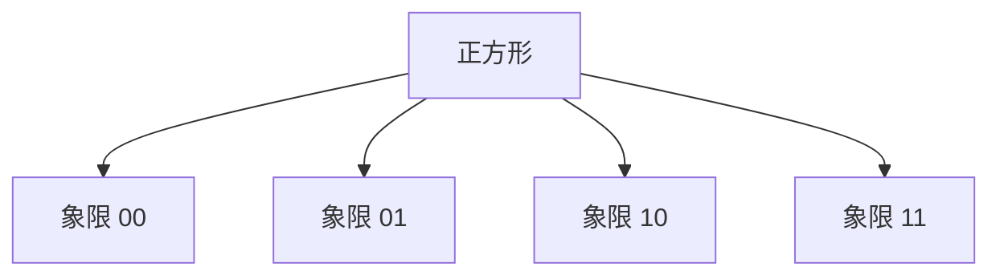

# 四叉树与八叉树

正方形一分为四、立方体一分为八；空块不再切。分辨率跟物体走，不跟数据页扇出走。

<footer>—— 据 Finkel and Bentley, Quad Trees: A Data Structure for Retrieval on Composite Keys, Acta Informatica 1974；Samet, Foundations of Multidimensional and Metric Data Structures 整理</footer>

[上一课](/cs/r-tree) 的 MBR 自适应且可重叠。[k-d 树](/cs/kd-tree) 按数据中位数切。若域是固定包围盒、物体是图像像素或体素，用规则分裂更简单。本课不写页分裂启发式。缺口是四叉树 / 八叉树：几何中点切，到容量或深度停止。

## 问题

平面区域或点集，反复把方块分成四象限，块内点少于阈值或到达最大深度则成叶。八叉树对立方体八分，用于三维场景、体素。查询：与询问区相交的块才下钻。缺口是**规则四/八分**，编码可用象限位，邻接查找有经典算法（Samet）。

Finkel and Bentley 1974。点四叉树与区域四叉树（黑白像素合并）是两种合同，本课都点名：前者叶存点，后者叶存均质块。

## 方法

插入点：从根走到含该点的叶，溢出则分裂再插。删除可能合并兄弟（若都变稀）。范围查询与 k-d 类似剪不相交方块。最近邻可优先探近的象限。

与 R 树：无 MBR 重叠问题，但空区域仍占树路径，偏斜数据会不平衡。与网格：四叉树是自适应分辨率网格。

## 机制

深度 $O(\log(1/\varepsilon))$ 于最小特征尺寸，不是 $O(\log n)$。最坏一条链（点挤在角上反复切）。三维八叉同构，只是扇出 8。本课不把 GPU 层次包围盒（BVH）写完，只承认同族。

空间填充曲线把四叉块序线性化，便于外存与缓存——下一课专门收 Hilbert / Morton。

## 边界

本课不写压缩四叉树的全部指针消除。高维 $2^k$ 叉爆炸，勿把八叉推广到 20 维。字符串与后缀不是空间树。

后课默认：规则空间层次用四叉/八叉。要把块序变成一维局部性，用空间填充曲线。

## 小结

- 四叉/八叉：规则中点分裂，叶达容量或深度。
- 平衡不保证；偏斜退化。
- 下一课用曲线把多维块排成一维。
- 出处：Finkel and Bentley, 1974；Samet 的多维结构综述与专著。
