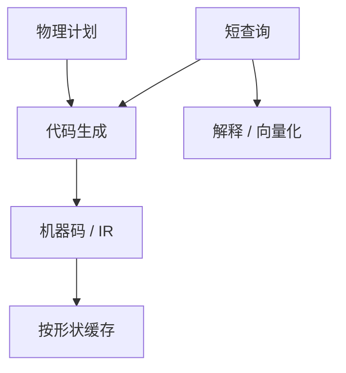

# 编译执行

把查询树编成循环与哈希调用，去掉算子间的虚函数与解释开关；计划变成一段代码，参数仍是绑定值。

<footer>—— 据 Neumann, Efficiently Compiling Efficient Query Plans, VLDB 2011；HyPer；LegoBase 等</footer>

[上一课](/cs/vectorized-execution)用批循环摊解释税。本课不规定批大小。缺口是再进一步：算子边界上的 `next` 即使按批仍有调度与分支。编译执行（query compilation）在优化之后生成机器码或低级 IR，push 模型（数据推进循环）常比拉模型更易熔合。

## 问题

Volcano 解释器：多态 `next`、每算子一帧。编译：对具体类型、具体谓词生成代码，连接键比较是内联函数。缺口是**编译延迟**：OLTP 每次 1ms 的查询不能每次 LLVM 优化 100ms。策略：缓存编译结果（与计划缓存对齐）、解释短查询、只编译长 OLAP、或分层 JIT。

正确性：生成代码必须实现同一代数，含 NULL、三值、溢出。调试比解释器难，计划回归会表现为「同一 SQL 不同二进制」。

Thomas Neumann, VLDB 2011，HyPer 的数据中心代码生成。后续工作用 LLVM 或自定义 IR。本课不把某编译器版本当标准。

## 方法

从物理计划走代码生成：扫描循环、谓词、物化哈希表的 insert/probe 例程。push：扫描驱动，把行推进父的回调或内联体，减少返回。向量化与编译结合：生成的是批循环。

注册与安全：生成代码在引擎进程内执行，错误隔离（除零）要变成 SQL 错误不是进程崩溃。

## 机制

计划缓存键必须包含编译选项与类型。模式变更失效与预编译课相同。自适应重优化：要重新生成代码或回退解释器。代价模型：编译时间计入优化超时。

与存储过程：过程体是语句序列，每句可分别编译；跨语句循环仍在过程语言解释器里，除非整过程编译。

## 边界

本课不讲外部排序算法——下一课。也不把 GPU/FPGA 代码生成写入必做。编译不是「一定更快」：极短点查，解释路径更短。

后课默认：长 OLAP 可编译；编译产物按计划形状缓存。外部排序是阻塞算子的经典落盘实现，与是否编译正交。

编译消灭算子调度，不消灭阻塞点：排序仍然要等输入尽。

## 小结

- 代码生成熔合算子，换编译时间与缓存复杂度。
- 短查询可解释；长查询才 JIT。
- 外部排序下一课：内存放不下时的阻塞算子。
- 出处：Neumann, VLDB 2011；HyPer；Graefe 执行背景。
