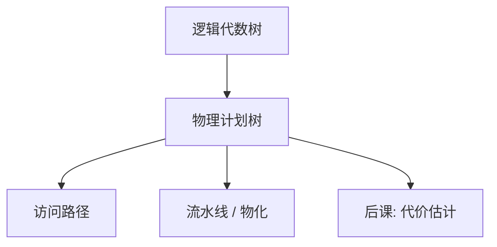

# 查询计划

逻辑树说结果是什么；物理计划说用哪些算子、何种顺序、每一步读哪份文件。

<footer>—— 据 Selinger et al., Access Path Selection in a Relational Database Management System, SIGMOD 1979 整理</footer>

[上一课](/cs/sort-merge-join)交出三种连接的 I/O 形状。本课不重做哈希表。缺口是：一条 SQL 对应许多物理树——扫描还是索引、连接谁先谁后、谓词在哪一层求值。计划是这棵被选中的算子树，后课才谈如何估代价并在候选中挑。

## 问题

声明语言允许优化器改写，但执行器只跑一棵具体的树：叶是访问路径（堆扫描、索引扫描），内节点是物理算子（过滤、投影、某一种连接、排序、聚集）。缺口不是代数等价，而是**把逻辑树特化成可执行的管道**，并记住管道上的顺序与物化点。

没有这棵树，后课的代价没有对象，改写也没有「改完之后跑什么」。本课不引入动态规划搜连接顺序的全部细节，只锁定计划 = 带物理选择的算子树。

System R 的 Selinger 路径选择把「访问路径」与「连接顺序」一起搜。本课先命名计划，数字模型下一课才写。

## 方法

从逻辑代数出发，为每个逻辑运算标注物理算法与预计的输入描述（有序否、有无索引）。流水线：父算子按需向子算子要下一批元组，中间结果不必全落地。物化：排序、哈希建表、某些聚集必须把输入收齐。迭代器模型（open / next / close）是执行器的接口，不是另一种查询语言。

## 机制

计划决定局部性：[缓冲](/cs/buffer-dirty)里的页是否被反复扫，取决于外层循环是表还是驱动索引。物化点把内存峰值从「整棵树同时活」改成「当前算子的工作区」。同一逻辑连接，左深树与bushy树的流水线形状不同，System R 常限左深以缩小搜索空间——这是搜索策略，不是语义。

解释执行按迭代器拉元组；代码生成把计划编成循环，本课不选哪一种，只要求：执行的对象是计划，不是 SQL 字符串。

## 边界

本课不把 `EXPLAIN` 输出当理论。也不处理自适应计划、运行时改树。并行与分布式计划（exchange、两阶段提交侧的查询）尚未进场；本课默认单机、单线程管道，后课事务另加锁与版本。

准备（prepare）可以把计划缓存起来，绑定变量改变的是常量，不是树的形状——那是实现加速，语义仍是这一棵。后课默认：谈到优化，改的是计划树；代价是树上的数；改写是逻辑层到逻辑层，再落到物理。

计划缓存使同一棵树服务许多绑定变量；正确性仍是那棵树的指称，不是「这次碰巧走了索引」。

## 小结

- 连接算法已在；本课把它们装进一棵可执行的物理树。
- 访问路径、流水线与物化点是计划的组成部分。
- 代价数字与搜谁最优，是后课缺口。
- 出处：Selinger et al., SIGMOD 1979；Garcia-Molina, Ullman and Widom。
