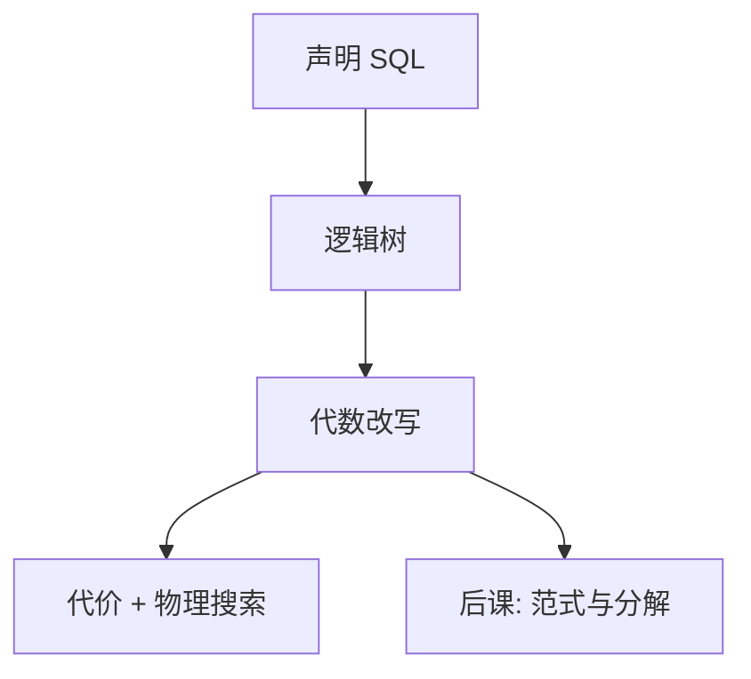

# 查询改写

先用代数律把树变得更瘦，再估代价；下推与结合律改的是形状，不是用户写的那句话。

<footer>—— 据 Ullman 对逻辑优化；Chaudhuri 对优化器架构的整理</footer>

[上一课](/cs/histogram-card)给计划树上的数字。本课不重写选择率公式。缺口是：许多等价逻辑树，有的让选择更早、连接更小。改写在逻辑层用代数律变换，再交给物理搜索与代价。没有改写，优化器只能在用户写出的那一棵歪树上估数字。

## 问题

用户可能先写笛卡尔积再过滤，或把能下推的谓词留在顶层。指称相同，中间结果可以差几个数量级。缺口不是新 SQL，而是**保持指称的变换**：选择下推、投影下推、连接结合律与交换律、把子查询改成连接。本课只做逻辑等价，不保证改完一定更快——更快由代价判定。

集合语义下选择与连接交换较干净；NULL 与包会打碎部分律。SQL 课已承认三值；改写器必须标哪些变换在当前语义下合法。

## 方法

把 SQL 收成逻辑树后，反复应用：$\sigma_\theta(R\bowtie S)$ 在 $\theta$ 只涉及 $R$ 时变成 $\sigma_\theta(R)\bowtie S$；投影只保留后继需要的列；连接树按结合律重括号。视图展开是改写的一种：把视图名换成定义树。本课不引入基于规则的引擎实现，只锁定变换前后指称相同。

## 机制

改写缩小中间基数，使后课的哈希表与排序输入变小；也可能为了用某一索引而**故意**保留某个谓词形状。启发式（始终下推）与基于代价的变换可以并存：先做几乎总赚的下推，再对连接顺序做代价搜索。相关子查询去相关，是把演算写法改回连接，以便用[连接算法](/cs/join-algorithms)。

本课不把「提示」当模型。提示是绕过搜索的工程旋钮；主干仍是等价变换加代价。

## 边界

改写不修复错误的统计，也不替代完整性。不能把有副作用的函数随便下推。分组、极限、窗口对交换律不友好，本课只点名：这些算子是改写的防火墙。也不把规范化（模式分解）与查询改写混成一步——下一课动的是模式，不是这一棵查询树。

外连接会挡住某些下推：NULL 填充使「先过滤再连接」与「先连接再过滤」不再同指称。后课默认：优化器先改逻辑树再估代价；谈到等价，指的是代数指称，不是计划字符串相同。

改写器与代价估计交替：先做几乎总合法的下推，再对连接顺序搜。指称不变是硬约束，快是软目标。

## 小结
- 相关子查询去相关是为了进入连接算法，不是为了换一种 SQL 方言。
- 有副作用的 UDF 是改写防火墙，本课不当成可下推的 $\sigma$。

- 代价已在；本课用代数律改逻辑树的形状。
- 下推与结合律保指称；快不快仍看估计。
- 模式为何难改写、要不要分解，是后课缺口。
- 出处：Garcia-Molina, Ullman and Widom；Chaudhuri, *An Overview of Query Optimization*, 1998。
