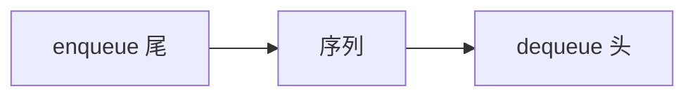

# 队列与缓冲

一端进、一端出，先来的先被服务；流水线与生产者-消费者要的是这个纪律，不是 LIFO。

<footer>—— 据 Knuth, The Art of Computer Programming 卷 1；Cormen, Leiserson, Rivest and Stein 整理</footer>

[上一课](/cs/stack-adt)把一端操作钉成 LIFO，并对齐调用帧。[流水线五级](/cs/stack-adt)里指令按取指序前进，ROB 也是按序提交的队列。[超标量发射](/cs/superscalar-issue)的发射窗口不是栈。本课不重讲 push/pop。缺口是 FIFO：enqueue 与 dequeue 分属两端，用来做缓冲而不是做嵌套寿命。

## 问题

栈会把后到的任务先处理，公平的等待线和流式缓冲都不允许。缺口不是新的节点类型，而是合同：抽象状态仍是序列，进尾出头。空出、满进无定义或返回失败。

循环数组用头尾下标模 $n$，避免每次 dequeue 搬移整块——那是数组插入的教训。链表队列用头尾两个指针，两端 $\Theta(1)$。本课两种表示都合法。

有界队列把背压写成「满则生产者停」。无界队列把背压推到内存耗尽。实时系统通常要有界。

## 方法

操作：enqueue、dequeue、队头窥视。代价：两种主表示下均为 $\Theta(1)$ 最坏（定容数组）或 $\Theta(1)$ 最坏（链表）。顺序与栈相反：先入先出。

环形缓冲：`tail = (tail+1) mod cap`。空与满用计数或浪费一个槽区分。这是实现细节，合同只看见 FIFO。

## 机制

缓冲把速率不同的两端解开：IF 取指快于 EX 时，中间的队列（或流水线寄存器链）托住气泡之外的指令流。软件上，日志、消息、BFS 的frontier 都是队列。BFS 后课才用；本课只把结构备好。

与[局部性原理](/cs/locality-principle)：环形数组顺序走，cache 友好；链表队列又回到指针追逐。高吞吐缓冲选数组。流水线寄存器是深度固定的队列；软件环形缓冲只是把深度做成参数。

## 边界

本课不引入优先队列——那是堆课，合同按键而不是按到达序。也不写无锁 Michael–Scott 队列。双端队列允许两端进出，合同更宽，主干不提前。

后课默认：缓冲 = FIFO 队列。数组环形是高性能默认表示。扩容数组的「偶尔 $\Theta(n)$ 复制」还没有分析方法。

## 小结

- 队列是 FIFO，两端操作；栈是 LIFO，一端操作。
- 环形数组或头尾链表均可 $\Theta(1)$；局部性偏向数组。
- 倍增扩容的平均代价是下一课摊还。
- 优先队列按键不按到达序，那是堆课。
- 有界队列把背压写成满则停；无界把背压推到内存。
- 出处：Knuth, *TAOCP* 卷 1；Cormen et al. 队列。
