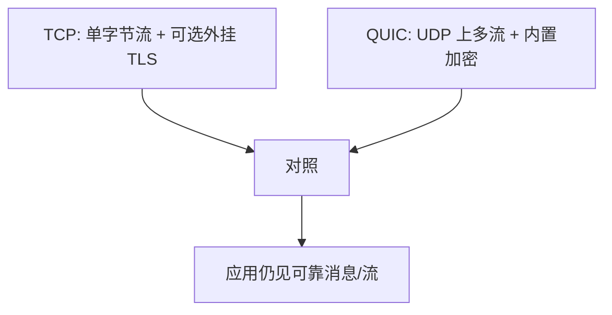

# QUIC 对照

QUIC 在 UDP 上做可靠流、拥塞控制与加密握手，避免 TCP 队头阻塞与内核握手的往返。

<footer>—— 据 Iyengar and Thomson, RFC 9000, QUIC: A UDP-Based Multiplexed and Secure Transport, 2021 整理</footer>

[上一课](/cs/bbr)让 TCP 能共用瓶颈。[三次握手](/cs/tcp-handshake)之后若还要 TLS，往返再加。[序号](/cs/tcp-seq-rexmit)在一条字节流上，丢失一块会挡住后面已到的流——HTTP/2 多流仍队头阻塞。缺口是对照：**QUIC** 把多路可靠流放到 UDP，加密默认在传输里。本课不写 TLS 记录层握手细节。

## 问题

TCP 中途的字节是一条全序流：段丢失，后续不能交给应用，即使它们属于另一 HTTP 事务。内核改 TCP 部署慢。RFC 9000：连接 ID、包号与流 ID 分离，丢包只挡一条流；握手与密钥在 QUIC 包里完成（1-RTT，有时 0-RTT）。缺口是这些对照，不是再推导 AIMD。

拥塞控制仍在，只是实现移到用户库，信号仍是丢/标记。

UDP 让 NAT 与中间盒把 QUIC 当数据报。连接 ID 允许换 IP 而不拆连接，对照 TCP 四元组绑死。

## 方法

应用打开 QUIC 连接（库内部 UDP 套接字）。多流并行，每流有序，流之间无全序。丢失用包号重传，不把包号当成 TCP 那种字节序号。本课不把帧类型清单背完。与[HTTP](/cs/http) 的接头在 HTTP/3：同一对象模型换传输。

## 机制

队头阻塞从「连接级」降到「流级」，符合多请求并行。端到端加密让中间盒看不见传输头——运维抓包变难，安全课再谈；本课只说明为何握手不能再裸露三次 ACK。拥塞：一条 QUIC 连接内多流共享 cwnd，避免每个浏览器流一条 TCP 时的过于激进。

与[信号量](/cs/semaphore)无关：这里的「流」不是 OS 线程。进程仍用后课套接字，只是协议是 UDP。

## 边界

本课不把 RFC 9001 的 TLS 映射逐步展开——完整握手在[后课 TLS](/cs/tls-handshake)。不引入 HTTP/3 帧与 QPACK。也不声称 UDP 总比 TCP 快：丢失修复与 CPU 实现决定。应用如何用名字找 IP，下一课 DNS。

0-RTT 数据可能被重放，应用要自己幂等。这是安全与传输的交界，握手课再收，本课只对照延迟。

用户态实现让拥塞算法可随应用更新，不必等内核发行版，这是部署动机之一。

后课默认：可靠传输可以是 TCP 或 QUIC。人用的名字如何变成地址，下一课 DNS。

## 小结

- QUIC（RFC 9000）对照 TCP：UDP、多流、连接 ID、加密绑定。
- 拥塞思想仍在；队头阻塞范围缩小。
- TLS 握手细节是安全课；本课只要求「传输自带认证加密通道」。
- 出处：RFC 9000；Kurose and Ross 新版对 QUIC 的讨论。
