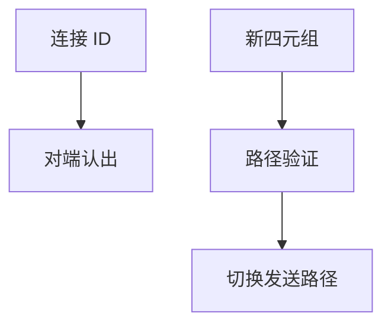

# QUIC 连接迁移

连接 ID 与地址解耦：路径变了用 PATH_CHALLENGE 验证新路，字节流不断；NAT 重绑与 Wi‑Fi/蜂窝切换是同一机制。

<footer>—— 据 RFC 9000 连接迁移；RFC 9002 恢复对照整理</footer>

[上一课](/cs/quic-streams-0rtt) 的连接还钉在四元组上叙事。TCP 换 IP 必断。[MPTCP](/cs/mptcp) 用子流。缺口是 **QUIC 迁移**：CID、路径验证、连接 ID 隐私。本课不把 BBRv2 写完。

## 问题

手机从 Wi‑Fi 到 LTE，TCP 四元组变，状态机作废。QUIC：包头 CID 让服务器认出连接，再验证新路径防劫持。旧路径可并存短暂。与蜂窝核心锚点对照：那是网络侧保 IP；迁移是端侧换 IP 仍保运输。Anonymizing CID 轮换防链路追踪。

不要把迁移写成 0-RTT 的一部分：0-RTT 是早数据，迁移是路径。

RFC 9000 第 9 节。禁用迁移的中间盒存在。本课不写负载均衡怎么粘 CID，后课 Maglev 会沾边。

### CID 解耦地址

新路径要挑战验证。拥塞状态不可盲目继承。服务器须能按 CID 路由到同一实例。与 0-RTT 不是一件事。

## 方法

画：旧路径 → 新地址 → PATH_CHALLENGE/RESPONSE → 切主路径。对照 MPTCP ADD_ADDR。卫星切换网关类似。

方法止于选定对象与对照；机制才说它如何嵌入已有分层与主干课。

## 机制

拥塞状态是否继承是实现：新路径 BDP 不同，盲目继承会炸。保活用 PING 帧，短于 TCP keepalive。SYN cookies 无对应，Retry 与 CID 由服务器发。ECMP 哈希因四元组变而换路，本就可能，迁移只是显式。

安全：未验证的新路径不能立刻收非探测数据，防迁移劫持。

## 边界

本课不引入 QUIC 多路径扩展的全部。BBRv2/v3 是下一课。后课默认：CID 使运输跨地址存活；要验证路径。

服务器集群必须能按 CID 路由到同一实例，否则迁移失败。

上一课留下的缺口在本课收口；「QUIC 连接迁移」进入后课词汇表后只引用。文献用来钉对象与边界，不把本课写成该主题的独立综述。下一课[BBRv2 / v3](/cs/bbr-v2-v3)。

## 小结

- CID 解耦连接与地址。
- 新路径要挑战验证。
- 拥塞状态不可盲目带着走。
- 后课只引用本课钉死的对象，不从该领域总问题重开。
- 出处：RFC 9000。
