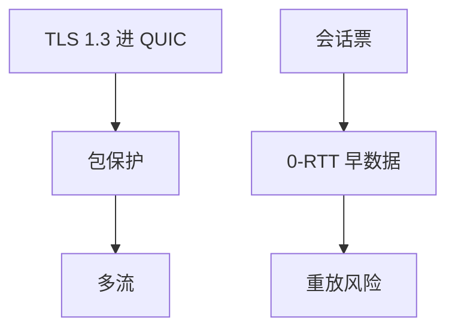

# QUIC 流与 0-RTT

QUIC 在 UDP 上做加密运输：多流免 TCP 队头阻塞，TLS 1.3 进握手；0-RTT 用上次票再发数据，有重放代价。

<footer>—— 据 RFC 9000 QUIC；RFC 9001 使用 TLS；RFC 8446 TLS 1.3 整理</footer>

主干[QUIC 对照](/cs/quic-contrast) 已给动机。[HTTP/2](/cs/http2) 多流仍落在一条 TCP 上。[上一课](/cs/sctp) 对照多流。缺口是 **QUIC 流与 0-RTT**：stream ID、加密、早数据。本课不把连接迁移写完。

## 问题

TCP+TLS：两次握手 RTT，且 TCP 丢包挡住所有 HTTP/2 流。QUIC：运输与加密一体，握手 1-RTT，会话票可 0-RTT 发请求。流独立丢失恢复（包号与流偏移分离）。0-RTT 数据可被重放，只适合幂等——后课重试会收回。UDP 被中间限速是部署税。

不要把 0-RTT 写成「无密钥」。

RFC 9000。拥塞仍在连接级，避免每流 AIMD 加倍。本课不把帧类型列完。

### 运输与 TLS 一体

多流免 TCP HOL。0-RTT 有重放，只适合幂等。拥塞在连接级。UDP 被限则回退。

## 方法

对照：TCP HOL vs QUIC 流。画：TLS 密钥 → 包保护 → 多 STREAM 帧。与 SYN cookies：QUIC Retry 抗泛洪。

方法止于选定对象与对照；机制才说它如何嵌入已有分层与主干课。

## 机制

TSO 变成 UDP GSO。ECN 计数在 QUIC 里。PMTUD 在用户态。BBR 常与 QUIC 同部署。SCTP 多流无 Web 加密集成。窗口是流控窗口+拥塞窗口两层，类似 HTTP/2 但加密。

握手失败回退 TCP 是浏览器政策，不是协议强制。

## 边界

本课不引入 DATAGRAM 扩展全文。QUIC 连接迁移是下一课。后课默认：QUIC 多流+集成 TLS；0-RTT 仅幂等。

公司防火墙「UDP 危险」会把用户打回 TCP HOL。

上一课留下的缺口在本课收口；「QUIC 流与 0-RTT」进入后课词汇表后只引用。文献用来钉对象与边界，不把本课写成该主题的独立综述。下一课[QUIC 连接迁移](/cs/quic-migration)。

## 小结

- 多流消除运输队头阻塞。
- 1-RTT 握手，0-RTT 有重放。
- 拥塞在连接级，流控在流级。
- 后课只引用本课钉死的对象，不从该领域总问题重开。
- 出处：RFC 9000；RFC 9001；RFC 8446。
