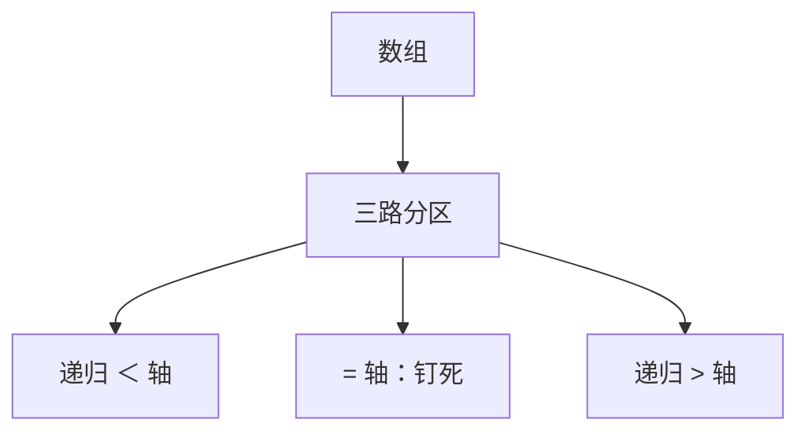

# 三路快排

等于轴的键一次聚成中段；左右只递归严格小于与严格大于，重复键不再把分区退化成单侧。

<footer>—— 据 Dijkstra, A Discipline of Programming, 1976；Bentley and McIlroy, Engineering a Sort Function, 1993；CLRS 第 7 章整理</footer>

上一课[快排与期望](/cs/quicksort-expected)给出随机两路分区：小于左、大于右，等于键落在哪一侧未规定。大量重复时，两路把等于轴的键仍丢进递归，最坏可接近平方。本课不重做指示器分析。缺口是**三路分区**：小于 / 等于 / 大于，中段钉死，只递归两端。

## 问题

两路 `partition` 的不变式通常是「左侧 $\lt $ 轴、右侧未处理」。等于轴的键被扫到左或右，下一层还会再比较它们。若输入全相等，$q=1$ 或 $q=n$，与已排序固定轴同一退化。缺口不是再抛一次硬币，而是荷兰国旗式的三段：扫描中维护 $\lt $、$=$、$\gt $ 三个区间，等于段不再递归。

随机轴仍在：期望分析把「等于」从比较次数里减掉，重复越多越快，与两路相反。本课仍在比较模型；不启用计数排序。

### 三路不是「再开一个等于数组」

就地交换即可。Dijkstra 的荷兰国旗是三段着色；Bentley–McIlroy 在工程里用双指针从两端收等于键，减少交换。本课认三段语义，不把某一份 `qsort` 抄成词条。

Hoare 的两路是上一课。Dijkstra 1976 把三段写成最严格的循环不变式。Bentley–McIlroy 1993 说明为何标准库排序必须处理重复。CLRS 第 7 章把相等键列为练习级缺口，本课收进主干。

## 方法

选轴（随机或三数取中）。一次扫描把数组排成 $A[L..q-1]\lt x$、$A[q..t]=x$、$A[t+1..R]\gt x$。递归 $(L,q-1)$ 与 $(t+1,R)$。正确性：中段已在最终位置。代价：无重复时与两路同阶；全相等时 $\Theta(n)$ 结束。

稳定性仍默认没有：交换打乱等于键的原次序。要稳定，退回归并，不要在三路上假装。

## 机制

信息论：重复键的排列数小于 $n!$，比较下界可以低于 $n\log n$。三路接近这个松弛；两路不利用。后课下界仍对**互异键**说话，本课先把重复从最坏路径上拿掉。

与[选择第 k 小](/cs/select-kth)：三路给出轴的一段秩，选择可以一次跳过整个等于段。本课不把选择写完。

## 边界

本课不证 $\Omega(n\log n)$，不引入基数。最坏互异键加劣轴仍平方；随机或保险轴仍要。也不处理多键（先比第一关键字再比第二）的整套 MSD。后课默认：快排在重复键上走三路；比较排序的下界下一课对互异键收回。

## 小结

- 三路把等于轴的键一次钉死，只递归严格两端。
- 重复从退化变成线性收束；默认仍不稳。
- 互异键的下界仍是下一课的对象。
- 出处：Dijkstra, 1976；Bentley and McIlroy, 1993；CLRS 第 7 章。
