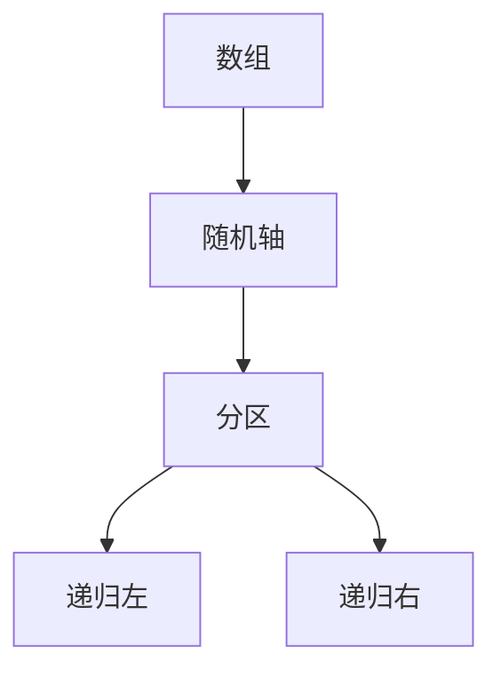

# 快排与期望

随机轴元把输入的次序洗进期望；最坏平方仍可能，期望比较次数却是 $O(n\log n)$。

<footer>—— 据 Hoare, Quicksort, 1962；CLRS 第 7 章整理</footer>

上一课[堆排序](/cs/heapsort)给出最坏 $\Theta(n\log n)$ 的就地比较排序。本课不重写下滤。缺口是：实践里更常见的是**分区**：选一个轴，小于的在左、大于的在右，再递归。最坏仍平方；要用[离散概率](/cs/discrete-probability)把代价写成期望，而不是再发明一种堆。

## 问题

Hoare 的分区把规模切成 $q$ 与 $n-q-1$。切法不保证对半：已排序数组上固定取末元，递归退化成 $T(n)=T(n-1)+\Theta(n)$，平方。堆排序没有这个问题，但它不分区、也不把相等键聚在轴两侧。缺口不是再证主定理，而是：**随机选轴（或先随机打乱）之后，期望比较次数是 $O(n\log n)$**。

本课仍在比较模型、仍在 P。指示器分析不需要图灵机。确定性最坏线性选择轴是[选择第 k 小](/cs/select-kth)才启用的；快排主干用随机就够。

### 期望不是平均输入

「对所有排列等概率」与「算法自己抛硬币」不是同一句话。本课采用后者：轴均匀随机，对任意固定输入谈期望。这样最坏输入不再特殊，期望由对称性给出。

指示器 $X_{ij}$：算法是否比较过秩为 $i$ 与 $j$ 的两个键。它们被比较当且仅当二者之一先当轴、且中间没有更早的轴。$\Pr=\frac{2}{j-i+1}$，求和即 $O(n\log n)$。

## 方法

`partition` 的不变式：扫描指针左侧小于轴、右侧未处理。递归对两段调用。期望：$T(n)$ 对切点均匀平均，主定理不能直接套（$b$ 随机）。改用指示器，或写出 $T(n)=\frac{1}{n}\sum_q\bigl(T(q)+T(n-q-1)\bigr)+\Theta(n)$ 再解。

空间：就地分区，额外主要是递归栈；期望深度 $O(\log n)$，最坏 $n$。尾递归消一侧可压栈，本课点名不实现。

## 机制

工程上常三数取中或随机打乱一次再固定取末元，期望同类。相等键要用三路分区，否则大量重复会退化；本课承认这件事，不把 Bentley–McIlroy 写完。稳定性默认没有：分区交换打乱相等键。

与堆排对照：期望更快、缓存更友好（顺序扫），最坏要靠随机或回退。本课不把「实际最快」当成定理。

## 边界

本课不证比较排序下界，不引入计数排序。最坏 $\Theta(n^2)$ 仍在；若必须最坏 $n\log n$，用堆或后面的最坏线性选择做轴。也不处理并行快排与外部排序。

后课默认：快排期望 $O(n\log n)$，最坏平方；分析工具是指示器。下界课问：比较模型里能否整体再快。

## 小结

- 随机快排期望 $O(n\log n)$，最坏仍平方。
- 期望对算法的硬币，不是假定输入均匀。
- 就地、默认不稳；栈深期望对数。
- 出处：Hoare, 1962；CLRS 第 7 章；Knuth, TAOCP vol. 3。
