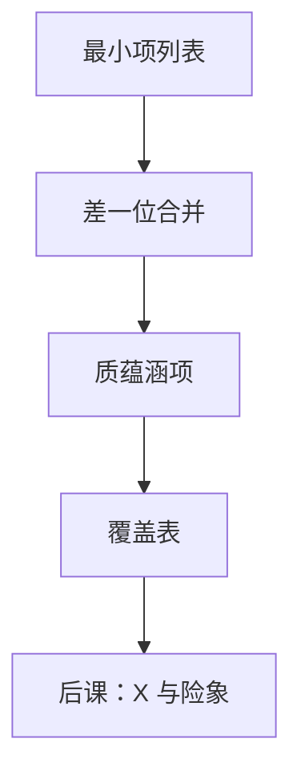

# Quine–McCluskey

把最小项按 $1$ 的个数分层，只合并差一位的对，列表就能代替格子；剩下的是集合覆盖，不是再画更大的图。

<footer>—— 据 Quine, The Problem of Simplifying Truth Functions, 1952；McCluskey, Minimization of Boolean Functions, 1956 整理</footer>

上一课[卡诺图与化简](/cs/karnaugh-map)钉死了：格雷码网格上 $2^k$ 相邻圈对应消去 $k$ 个变量。本课不重画四变量图，也不从「逻辑综合史」另起。缺口是：$n\ge 5$ 时图要对折，眼力覆盖不是算法。完全指定函数仍要两级 SOP，需要一份**可程序化的列表**。

## 问题

卡诺图把汉明距离 $1$ 画成邻居。同一合并，写成：将最小项当二进制编号，只把差一位且未用过的对合成带 `-` 的蕴涵项，再重复，直到不能合并。活下来的是**质蕴涵项**。缺口的另一半：每个 $1$ 必须被盖住；本质质蕴涵项先拿走，其余是集合覆盖（Petrick 或枚举）。这不是多项式时间保证最优——本课承认 NP 难，手算只处理小表。

无关项与险象故意留给[下一课](/cs/dont-care-hazard)。本课函数完全指定。

### 质蕴涵项不是「最长的圈」

质蕴涵项是不能再扩大的乘积项。最短 SOP 还可能丢掉某些非本质项。把「列出全部质蕴涵项」当成已经最小，覆盖表会少做一列。

Quine 给出质蕴涵项的逻辑定义。McCluskey 把表格法写成工程步骤，与卡诺图同一代数：合并差一位的最小项。后课综合器走的是同类覆盖，规模用启发式。

## 方法

(1) 列出 $f=1$ 的最小项。(2) 按重量分组，合并差一位者，标记被合并项。(3) 未被标记的项即质蕴涵项。(4) 覆盖表：行是质蕴涵项，列是最小项；先取只被一行盖住的本质项，再覆盖剩余列。

## 机制

列表法与卡诺图输出同一类两级式，只是邻接改由编号异或重量为 $1$ 判定——[Gray 码](/cs/gray-code)课的相邻在这里变成整数差一位。面积与延迟仍是两级与或；多级分解不在本课。后课 ALU 控制若变量多，默认不再手画六维图，而承认用表或工具做覆盖。

## 边界

本课不处理 $X$、不消静态险象、不把 Espresso 等启发式写成步骤。多输出共享乘积项是另一张覆盖表。时序激励函数会用同一算法，状态对象还没有。

后课默认：完全指定函数的两级最小 SOP 可用 Quine–McCluskey 列出质蕴涵项再覆盖；不完全指定与毛刺另说。

## 小结

- 按重量合并差一位的项，得到质蕴涵项。
- 最短式还要做集合覆盖；本质项先取。
- 与卡诺图同代数，可程序化，不保证大 $n$ 可手算。
- 出处：Quine, 1952；McCluskey, 1956。
