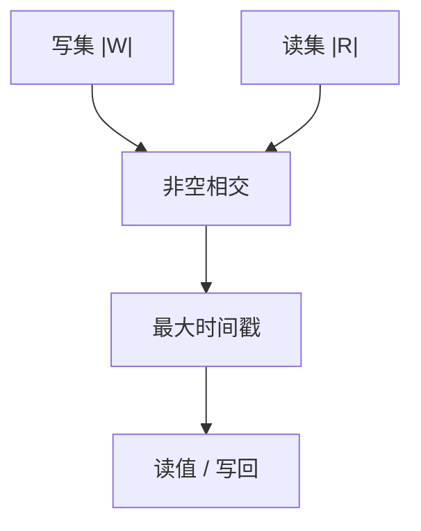

# Quorum 读写

写集与读集必须相交。相交点上带着足够新的时间戳，读就能拼出最近一次完成的写。

<footer>—— 据 Gifford, Weighted Voting for Replicated Data, SOSP 1979；Attiya, Bar-Noy and Dolev, Sharing Memory Robustly in Message-Passing Systems, JACM 1995 整理</footer>

上一课[链式复制](/cs/chain-replication)用拓扑固定提交点。缺口是**集合相交**：不排成链，也能让每次读撞上每次写。本课钉 $R+W>n$（及权重推广），不把 Dynamo 的 sloppy quorum 提前当默认。后课反熵处理「写没到齐」。

## 问题

$n$ 个副本，写等 $W$ 个 ack，读问 $R$ 个，取时间戳最大者。若 $R+W>n$，任一读集与任一写集共享至少一节点，该节点若保存了那次写，读就能看见。Attiya–Bar-Noy–Dolev（ABD）在异步崩溃下用两轮读/写给出线性一致寄存器：读也要再传播，防止旧值回写。

缺口：相交是安全的组合学；延迟是等最慢的那个法定人数成员。$W=n,R=1$ 写最慢读最快；$W=1,R=n$ 相反；$W=R=\lfloor n/2\rfloor+1$ 对称。这是[PACELC](/cs/cap-pacelc)无分区时的旋钮。

Gifford 加权投票：节点带票数，法定人数是票和，不是台数。ABD 说明消息传递上模拟共享内存要两轮。

## 方法

每值带单调时间戳（Lamport 钟或主序）。写：把新值送到 $W$ 个。读：收 $R$ 份，选最大时间戳；若要线性一致，把该值再写回 $W$（ABD 的 read-repair/传播）。时间戳不可比时不能只靠墙钟——接[物理时钟](/cs/clock-drift)的 $\varepsilon$。

分区：多数派只在一侧，另一侧 $W$ 凑不齐则停写（CP）。若降低 $W$ 使 $R+W\le n$，相交消失，进入最终一致。

## 机制

Sloppy quorum（后课 Dynamo）：写进提示节点，相交暂时不成立，靠反熵补。那是故意放弃 ABD 安全换可用。严格 quorum 下，失败的写可能只到 $W-1$：读可能看见也可能看不见，线性一致要求把不确定的写当成未提交或用两阶段。工程上常用「写满 W 才 ack 客户端」，未 ack 的写以重试+幂等消化。

权重：慢盘少投票，SSD 多投票，仍要最坏相交。不要把权重当成负载均衡的充分条件。

本课不把 Raft 多数派日志当寄存器 quorum：共识是对**操作序列**的相交，寄存器是对**单值**的相交。后课 RSM 会接上。

## 边界

本课不写 Merkle 树，不引入 LWW 细节。不把「三个九」当 $n=3$ 的证明。后课默认：$R+W>n$ 加单调时间戳给崩溃异步寄存器；要可用性就放松相交并接受冲突。Dynamo 把放松做成系统。

相交是集合论，时间戳是打破平局的全序。缺一则读无「最近」。

## 小结

- $R+W>n$（或加权票和）保证读写集相交。
- ABD：异步线性一致寄存器要读传播。
- 相交放松即放弃该寄存器的线性一致。
- 出处：Gifford, SOSP 1979；Attiya, Bar-Noy and Dolev, JACM 1995。
