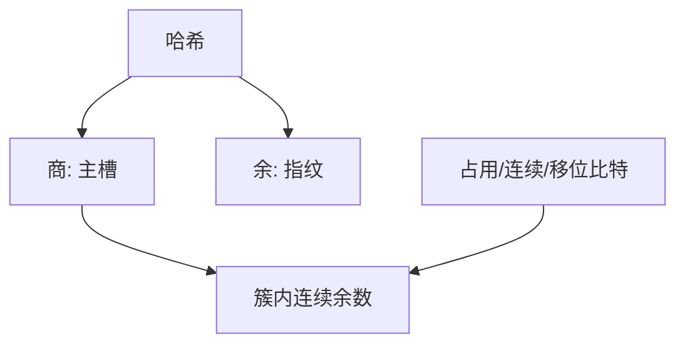

# 商过滤器

哈希拆成商与余；槽按商顺序紧排，用几比特元数据标簇的起止，查找沿簇线性探测。

<footer>—— 据 Bender, Farach-Colton, Johnson, Kuszmaul, Medjedovic, Montes, Shetty, Spillane and Zadok, Don't Thrash: How to Cache Your Hash on Flash, PVLDB 2012 整理</footer>

[上一课](/cs/cuckoo-filter) 两桶随机跳。[局部性](/cs/locality-principle) 上线性探测更吃缓存与 SSD。[Robin Hood](/cs/robin-cuckoo) 已在精确表里用过距离。本课不踢两巢。缺口是 quotient filter：把键的哈希写成 $q$ 位商 + $r$ 位余，表按下标 $q$ 的主桶存放余数串。

## 问题

Bloom/布谷随机访存多。商过滤器：理想位置是槽 $q$，冲突把余数向后挪但仍属同一 runs/cluster，用 `is_occupied` / `is_continuation` / `is_shifted` 三比特描述。查找：从 $q$ 找到本簇，扫余数是否匹配。缺口是**用商当地址、余当指纹**，顺序扫描短簇，外存友好。

Bender et al., *PVLDB*, 2012（Don't Thrash… on Flash）。可删：在 run 里摘余数并修元数据。假阳性约 $2^{-r}$ 量级。

## 方法

插入：定位 run，插入余数保持有序或按移位规则，更新三比特。满则再哈希扩容。合并两个过滤器：同参数时可归并有序 runs，适合 LSM 思想——后课 LSM 再接。

与开放寻址精确表：这里不存键，只存余数，故近似。与布谷：访存更顺序，插入移位可能 $\Theta(\text{簇长})$。

## 机制

三比特不变式保证能从任意 occupied 槽重建 run 边界。实现易错，教学以不变式为主。Flash：少随机写，符合论文动机。不要用商过滤器当精确完美散列。

下一课从成员转到相似：MinHash 估计 Jaccard。

## 边界

本课不把 counting quotient filter 全文写完。并发 QF 有后续工作，点名即可。集合相似度不是过滤器合同。

后课默认：外存友好近似集可用商过滤器。Jaccard 近似用 MinHash 与 LSH。

## 小结

- 商过滤器：商定位、余数紧排、三比特描簇。
- 可删、顺序访存好；假阳性随余数位。
- 下一课估集合相似而非成员。
- 出处：Bender et al., *PVLDB*, 2012。
