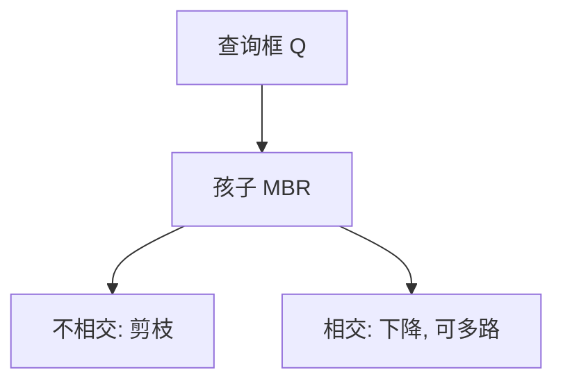

# R 树

每个节点存若干子矩形的最小外包框；查询框与 MBR 不相交则整页剪掉，相交则下降——为磁盘页而不是为内存二分。

<footer>—— 据 Guttman, R-Trees: A Dynamic Index Structure for Spatial Searching, SIGMOD 1984；Beckmann et al., R*-tree, SIGMOD 1990 整理</footer>

[上一课](/cs/kd-tree) 适合内存点集，节点太瘦，外存一次 I/O 只比较一个分裂值。[B+](/cs/bplus-split) 已说明页要高扇出。本课不轮换轴。缺口是 R 树：页内多条记录，各带最小外包矩形（MBR），插入选「扩大面积最小」的子树，溢出则分裂。

## 问题

空间对象（点、框、多边形外包）要按页索引。查询矩形 $Q$：根到叶，只进入 $MBR\cap Q\neq\emptyset$ 的孩子。MBR 可重叠，故可能多路下降，最坏仍扫很多页。缺口不是新的几何谓词，而是**把 B 树的页占用率思想搬到矩形键**，分裂启发式决定重叠多少。

Guttman SIGMOD 1984。R* 调整插入与强制重插以减重叠。本课钉 MBR 与剪枝，不把 R* 全部规则抄成词条。

## 方法

查找：与 $Q$ 相交则递归。插入：从根选子树（最小面积增量等），叶满则分裂成两组，使两组 MBR 面积和或重叠小，再向上插索引项。删除：欠载则合并或再分配，类似 B+。

与 k-d：R 树允许 MBR 重叠、面向块；k-d 空间不相交、面向内存。与四叉树：规则网格分裂 vs 数据自适应矩形。

## 机制

I/O 次数 ≈ 访问节点数。重叠大则剪枝弱，这是调分裂的原因。并发与 B 树锁耦合类似，本课串行。不要把 R 树写成神经网络空间；就是外存空间索引。

## 边界

本课不写 Hilbert 打包的具体码（下一课空间填充曲线会给序），不写三维 GIS 全流程。点集规则划分可用四叉/八叉，不一定要 R。

后课默认：外存空间范围查询默认 R 树家族。规则空间二分用四叉树。

## 小结

- R 树：分页 MBR 树，查询靠框相交剪枝。
- 分裂启发式决定重叠；最坏可退化。
- 规则网格划分是四叉/八叉树。
- 出处：Guttman, *SIGMOD*, 1984；Beckmann et al., *SIGMOD*, 1990。
