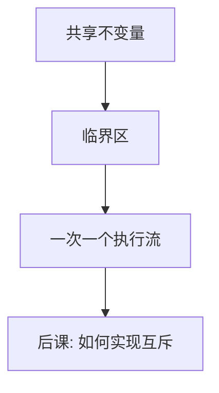

# 竞争与临界区

并发程序的正确性不能依赖「刚好不会交错」；必须标出一次只许一个执行流进入的代码区间。

<footer>—— 据 Dijkstra, Cooperating Sequential Processes, 1965；Silberschatz et al. 整理</footer>

[上一课](/cs/numa-sched)让进程经内核缓冲传字节；[线程](/cs/thread-shared-addr)还能直接改同一堆。调度与中断随时切开指令序列。缺口是：对共享变量的「读改写」一旦交错，结果不再是任何一方的顺序意图。本课命名竞争与临界区，不给出锁的实现。

## 问题

计数器 `n++` 在机器上常是载入、加一、写回。两条线程各加一次，交错后可能只加一次。管道缓冲的头尾指针同样。缺口不是新的 IPC 种类，而是承认**并发对象**有不变量，必须在临界区里维护：区内禁止另一竞争者进入。

本课的临界区是逻辑区间，不是 x86 的临界指令前缀。互斥如何用关中断或原子指令做成，下一课。

竞争是「结果依赖于交错」。数据竞争常特指无同步的冲突访存；本课先用更宽的「竞争」：共享不变量被交错打破。

## 方法

列出共享状态与不变量（例如「缓冲中字节数 = 头减尾」）。把所有可能打破它的指令收进临界区。要求：互斥、有限等待、空闲让进（Dijkstra 的条件）。正确性用交错论证：区内相当于原子。本课不写形式模型；[循环不变量](/cs/loop-invariant)的精神在并发里变成「锁外看不见中间态」。

## 机制

没有临界区，管道与共享堆都不能谈正确，只能谈「多跑几次碰巧对」。有了临界区，调度可以任意抢占：只要不在无锁情况下改共享元数据。信号处理器若碰同一变量，也是竞争者——上一课的可重入在这里落地。

生产者—消费者的「缓冲满/空」还要等待，不只互斥；那是信号量与管程的缺口。本课只处理「不能同时进」。

## 边界

本课不引入内存模型的 happens-before，不把无锁算法当主干，也不把越界写当成同步问题：那是更后的安全课。也不把数据库事务隔离混进来。

编译器可以把无锁共享读写优化掉；临界区必须配内存屏障或语言级原子，细节在锁课落地。

本课不把「看起来像原子的一行 C」当成临界区。

后课默认：共享不变量只在临界区里改。临界区如何做成互斥——关中断、自旋、锁——下一课。

## 小结

- 交错会打破共享不变量；临界区一次只许一个竞争者。
- 互斥条件先于锁的实现。
- 等待「条件成立」超出本课，走向信号量。
- 出处：Dijkstra, *Cooperating Sequential Processes*, 1965；Silberschatz et al., *OSC*。
