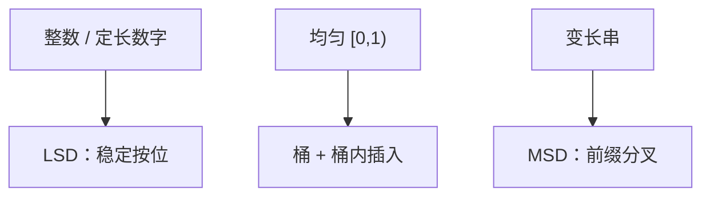

# 基数与桶

LSD 基数依赖稳定的按位分配；桶排序把均匀假设换成期望线性，最坏仍可退回比较。

<footer>—— 据 Knuth, TAOCP vol. 3；CLRS 第 8 章整理</footer>

上一课[线性时间排序](/cs/linear-time-sort)已交出计数与 LSD 基数：键在 $\{0,\ldots,k\}$ 或 $d$ 位数字上，$\Theta(n+k)$ 或 $\Theta(d(n+r))$。主干停在「从低位到高位、子过程必须稳定」。本课不重写前缀和。缺口是两块对照：桶排序的概率模型，以及 MSD 与字符串——上一课点名未写。后课选择第 $k$ 小仍回比较模型。

## 问题

计数要值域数组。若键是 $[0,1)$ 上的实数（或已归一化），不能直接当索引。桶排序：划 $n$ 个等宽桶，落入同一桶的用插入排，再拼接。均匀独立时每桶期望 $O(1)$ 个，总期望 $\Theta(n)$；最坏一桶装完，$O(n^2)$。缺口不是再推翻比较下界，而是**期望线性买分布假设**，与计数的最坏线性分开。

MSD 基数：先按最高位分桶，再对每个非空桶递归。对变长字符串自然：已分叉的前缀不必再比。LSD 要定长或先按长度垫。稳定：LSD 必须；MSD 分桶后各桶独立，桶内可用插入或再 MSD。

### 桶不是散列

散列打散且不保序。桶的编号是键的单调函数，拼接才有序。把哈希表当排序是另一错误模型。计数是桶的极端：每个键值一个桶，桶内至多计数、没有比较。

Knuth 把分配排序与比较排序分卷叙述。CLRS 8.4 桶排序、8.3 基数。本课把上一课未写的均匀假设与 MSD 收进来，不把浮点位型再映射一遍。

## 方法

桶：算桶号 $\lfloor n\cdot key\rfloor$（键已在 $[0,1)$），桶内插入，按桶号扫出。LSD：对 $j=1..d$ 稳定计数按第 $j$ 位。MSD：按最高位分配，对大小超过阈值的桶递归，小桶改插入。

正确性：LSD 归纳「最低 $j$ 位有序」；MSD 归纳「当前前缀已对齐，桶间有序」。桶的期望对输入分布，不是算法抛硬币。

## 机制

空间：桶指针加计数数组。缓存：大量随机桶号会打散写，实践上不如比较排序友好——本课点名，不模拟 Cache。与[三路快排](/cs/quicksort-3way)：MSD 的「当前位相等」进入同一子桶，语义相近，模型仍是数字位而非比较。

$k$ 或 $r$ 随 $n$ 增长时，线性系数变差。单词长 RAM 上的整数排序更快，仍不启用。

## 边界

本课不声称一般排序 $O(n)$。没有值域或分布，比较墙仍在。外存多路归并不是桶。后课默认：LSD/MSD 与桶的假设已分开；第 $k$ 小回到比较模型，不必排完。

## 小结

- LSD 要稳定按位；MSD 适合变长前缀。
- 桶排序期望线性依赖均匀；最坏平方。
- 选择第 $k$ 小不是全排序，下一课另开。
- 出处：Knuth, TAOCP vol. 3；CLRS 第 8 章。
