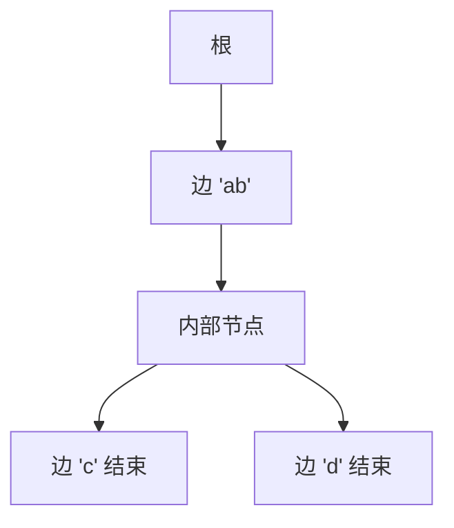

# 基数树

单孩子的路径不必每个字符一个节点：把边标成一段串，节点数跟相异前缀走，不跟键长总和走。

<footer>—— 据 Morrison, PATRICIA — Practical Algorithm To Retrieve Information Coded in Alphanumeric, JACM 1968；Fredkin, Trie Memory, CACM 1960 对照</footer>

[上一课](/cs/trie)按字符下降、点名 Patricia/radix 压缩单孩子路径却不展开。本课不重讲结束标记。缺口是压缩：边标签是非空串（或一串二进制位），内部节点至少两个孩子（Patricia 常如此），查找时沿边比较整段。并查集下一课换合同；本课仍是串键字典。

## 问题

Trie 最坏节点数 $\Theta(\sum L_i)$：一条长键、没有共享前缀时，链上每个字符一个节点，指针与 cache 行都浪费。缺口不是换字母表，而是**把无分支路径收成一条边**。插入若在边中间分叉，把边劈开，新内部节点挂两个孩子。

二进制 PATRICIA 按比特跳过「与兄弟相同的前缀」，跳过的位数存在节点里。字节 radix 树按字符块，思想相同。

Linux radix tree、路由表、内核页 cache 常用这一族。本课只交结构，不写内核 API。

## 方法

查找键 $s$：从根比较当前边标签与 $s$ 的剩余前缀，全匹配则沿边走，失配则失败；到节点看结束位。插入：失配在边中则分裂该边。删除：若剩单孩子，可把边再合并回去，保持压缩。

与 BST：比较的是键的数字/字符结构，不是全键序比较一次（虽中序仍可能有序，若字母序）。与散列：支持最长前缀匹配——路由课会用，本课只承认结构能做。

## 机制

空间接近「相异前缀的段数」。查找步数 $\Theta(L)$ 符号比较仍在，但指针追逐次数变成 $\Theta($分叉点$)$，对 cache 更友好。扇出实现仍可数组/哈希，与 Trie 课相同。

键是整数时，按比特的 Patricia 给出 $\Theta(w)$ 最坏，$w$ 为字宽，与 $n$ 无关——这是数字查找树相对比较树的合同。

## 边界

本课不把后缀树、后缀数组写进来，不把 AC 自动机当主干。也不进入大模型词表。并查集的键是元素编号、合同是分区，下一课不再沿符号下降。

后课默认：长键、稀疏前缀用压缩基数树。不相交集合的合并查找是另一 ADT。

## 小结

- 基数/Patricia：压缩无分支路径，分裂边上插入。
- 指针次数跟分叉走；最长前缀自然。
- 分区 ADT 是下一课并查集，不保管串。
- 出处：Morrison, *JACM*, 1968；Fredkin, *CACM*, 1960。
