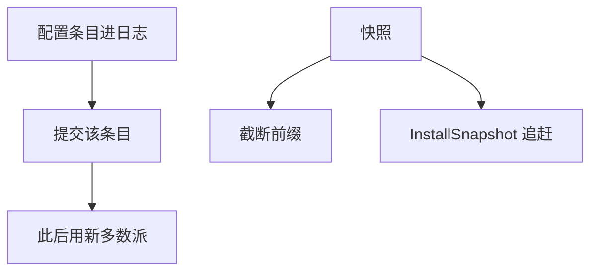

# Raft 成员变更与快照

配置也是日志里的条目。一次只加或减一个节点，新旧多数派重叠。快照截断已提交前缀，安装快照是追赶而不是改历史。

<footer>—— 据 Ongaro and Ousterhout, USENIX ATC 2014 论文 §4–6 整理</footer>

上一课[Raft](/cs/raft)固定成员集合。缺口是**集群要伸缩、日志要截断**：磁盘不能无限长，节点要替换。本课不重写投票规则。后课 Zab 用自己的纪元切配置，对照用，不混协议。

## 问题

成员变更若「直接改多数派定义」，会存在一瞬两个不相交多数派同时选出两个主。Raft 论文先给联合共识（新旧配置的多数派都要同意），实现常用**单步变更**：每次日志只加一台或减一台，因为单步时新旧多数派必交。配置在日志中提交之前，领导者同时用新旧计数——细节以论文为准：未提交配置已用于计数，这是实现敏感点。

快照：把已提交状态写成快照文件，丢弃其前的日志。跟随者落后太多则 InstallSnapshot。快照包含 lastIncludedIndex/term，以接上后面的日志匹配。

单步变更被 etcd 等采用，因为比联合共识少状态。错误实现会出现裂脑配置，Jepsen 测过这类洞。

## 方法

加节点：先以非投票学习者追日志（工程常见，论文核心是配置条目），再提交「加入」配置。减节点：提交「删除」，被删者停。领导者若发现自己不在新配置中，退位。

快照必须包含成员配置，否则截断后不知道法定人数。这把配置当成状态机状态的一部分，符合[RSM](/cs/replicated-state-machine)。

## 机制

安全：单步使任意两次相邻配置的多数派相交，不能并发生成两个主。跳步（一次加两台）破坏该论证。变更过程中可用性可能降：更易凑不齐。

快照不是 Chandy–Lamport 全局切：它是单对象状态机的前缀压缩。安装快照会丢掉跟随者上与领导者冲突的未提交尾，与 AppendEntries 回退同族。

本课不写 Kubernetes 滚动升级（后课系统模式）。也不把快照当备份策略全文：备份还要一致切与加密，那是运维。

## 边界

本课不证联合共识全部不变量，不引入学习者的形式化。后课默认：改 $n$ 必须走日志里的配置条目；截断必须快照带配置与 last term。下一课 ZooKeeper 的 Zab 用事务标识与纪元做类似的事，术语不同。

配置是数据。把它放在带外「人肉改文件」等于绕过共识。

## 小结

- 单步成员变更保持相邻多数派相交。
- 配置作为日志条目提交后才切换计数。
- 快照压缩已提交前缀；安装是强制对齐。
- 出处：Ongaro and Ousterhout, ATC 2014。
