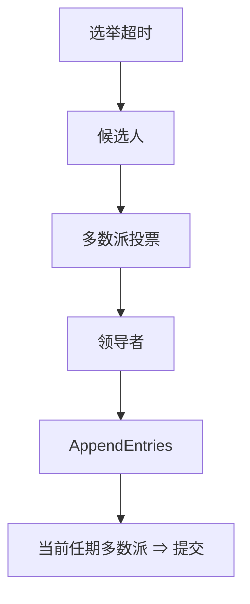

# Raft

为可理解性重铸 Multi-Paxos：任期、日志匹配、只有最新日志者能当选。安全规则写进状态机，减少「议会」歧义。

<footer>—— 据 Ongaro and Ousterhout, In Search of an Understandable Consensus Algorithm, USENIX ATC 2014 整理</footer>

上一课[Multi-Paxos](/cs/multi-paxos)已是稳定主 + 日志。缺口是**实现者仍把 Paxos 理解岔**：日志空洞、谁能当选、提交规则。Raft 用更严的约束换更少的合法交错。本课不重证多数派相交。后课成员变更与快照是论文后半，本课只到单配置日志。

## 问题

状态：Follower / Candidate / Leader。超时无心跳则竞选：自增 term，请求投票。投票：至多一票每任期；候选人日志必须至少与自己一样新（最后条目的 term、index 比较）。当选后 AppendEntries 复制，心跳是空追加。提交：当前任期条目在多数派出现才提交；借此避免论文里讨论的旧任期条目陷阱。

缺口：日志匹配性质——若两日志同一 index 同一 term，则该 index 及之前完全相同。AppendEntries 带前驱 index/term，不一致则拒绝并回退。比「每槽独立 Paxos」更少空洞玩法。

ATC 2014 与博士论文给出证明与 TLA+。本课不搬完整不变式表，后课 TLA+ 会回到 Raft 规格。

## 方法

客户端只打领导者。跟随者拒绝写。读：线性一致要用 read index 或租约，论文实现常先给宽松读——规格上要分开。持久化：currentTerm、votedFor、日志条目在应答 RPC 前要上盘（崩溃恢复模型）。

与 Paxos 编号：term 即 ballot。与检测器：超时实现 $\Diamond$ 类怀疑，误选举破坏活不破坏安全（旧领导者的 AppendEntries 因 term 小被拒）。

## 机制

「只有足够新的日志能当选」让领导者上任时不必从接受者那里搜集所有槽的已接受值再对齐——跟随者将被强制对齐到领导者日志（可能丢掉未提交尾部）。这是相对经典 Paxos 的实现选择：更简单，未提交条目可能被覆盖，客户端须重试。

本课不把 etcd 源码当规范。也不把 Raft 写成拜占庭协议。随机选举超时减脑裂竞选，是活性工程，不是安全。

与[FLP](/cs/flp-impossibility)：选举超时 = 部分同步。关掉超时，Raft 也不终止。

## 边界

本课不写联合共识成员变更、不写快照 RPC。不引入 PreVote 作为必选项（常见工程补丁，点名）。后课专门补成员与快照。Zab、VR 是亲戚，稍后对照，不在本课展开。

可理解性是设计目标：更少的合法状态，代价是更严的回退与覆盖未提交尾。

## 小结

- 任期 + 日志匹配 + 最新日志当选。
- 只提交当前任期的多数派条目。
- 安全不靠超时；活性靠超时与随机化。
- 出处：Ongaro and Ousterhout, USENIX ATC 2014。
