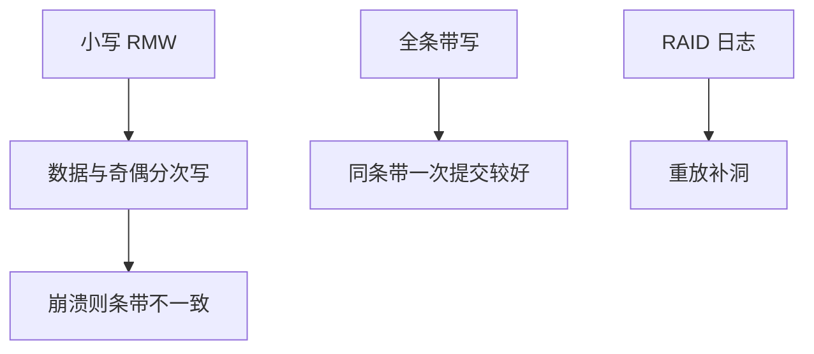

# RAID 级别与写洞

RAID5 写数据与奇偶不是一条原子总线事务：崩溃可留下「数据新、奇偶旧」，洞里的块无法从其余盘重建。

<footer>—— 据 Patterson et al. 对 RAID 级别的分类；Linux MD 对 dirty region / journal 的补丁说明；McKusick 对冗余的讨论</footer>

[上一课](/cs/md-raid)能装配阵列。Patterson 的级别决定代价。奇偶阵列还有 **写洞**：不是 FS 的 [日志](/cs/ext4-journal)，而是条带更新的崩溃窗口。

## 问题

RAID0：条带，无冗余。RAID1：镜像。RAID4：专用奇偶盘，写热点。RAID5：奇偶轮转。RAID6：双奇偶。RAID10：条带加镜像。小写（read-modify-write）：读旧数据与旧奇偶，算新奇偶，写新数据与新奇偶——四次 I/O，顺序一断即洞。缺口：为何全条带写较好；md 的 raid456 可用日志盘或 RMW 顺序；ZFS RAID-Z 用 COW 避免覆盖写洞（存储栈仍要懂洞的定义）。

写洞不是静默比特翻转——那是 scrub 课。洞是崩溃导致的条带不一致。硬件 RAID 用电池后备写缓存假装原子。

## 方法

大写：凑满条带只写新数据+新奇偶，无需读改。小写：必须 RMW。崩溃恢复：有 bitmap/journal 则重放或重算该区域；无则该条带可能不可重建。对照 [软更新](/cs/soft-updates)：都是写序；对象一个是 FS 缓冲，一个是 RAID 条带。对照 dm：同一洞在 dm-raid 同样存在。

## 机制

级别选择是容量、故障数、写放大的权衡。写洞说明「冗余」不等于「更新原子」。FS 的 ordered 模式不能自动填 RAID 洞——两层各管各的。不要把本课写成采购表。

与 [fsync](/cs/fsync)：应用 fsync 成功只保证逻辑设备完成；若 RAID 内部仍重排且无电池，洞仍可能在掉电时出现——依赖实现是否把 flush 做到成员盘。

实现上：电池后备写缓存把洞推迟到电池耗尽。日记盘或 RAID-Z 的分配即新块，避免覆盖同一条带。全条带写仍要保证那一次条带内各成员的持久顺序。 读法上只引用[上一课](/cs/md-raid)的结论，不把对象换成训练推理或限价簿。

本课在操作系统进阶的「存储栈 / 块层到设备」课序里，对象是 **RAID 级别与写洞**。

- 先修只引用，不重导：上一课的结论当公理，本课只补差。
- 五栏不吞并：不把本课写成大模型训练/推理，也不写成限价簿或权重量化。
- 文献用 OSTEP、McKusick、内核文档与具名会议论文；不发明 arXiv 编号。

## 边界

本课不引入纠删码的全部有限域算术——计算机课已有有限域，这里不重写。下一课在映射表上加密：dm-crypt。

版本字段会变，课序钉的是机制对象「RAID 级别与写洞」，不是某一主线内核的结构体名。
后课默认：奇偶 RAID 有写洞，需日志或 COW 布局缓解。块层加密如何叠在设备上，下一课 dm-crypt。

## 小结

- 级别决定冗余与写放大；RAID5/6 小写有写洞。
- 日志盘、全条带、COW 池是不同补法。
- dm-crypt 是下一课。
- 出处：Patterson et al.；Linux MD raid456；*OSTEP* RAID 章。
