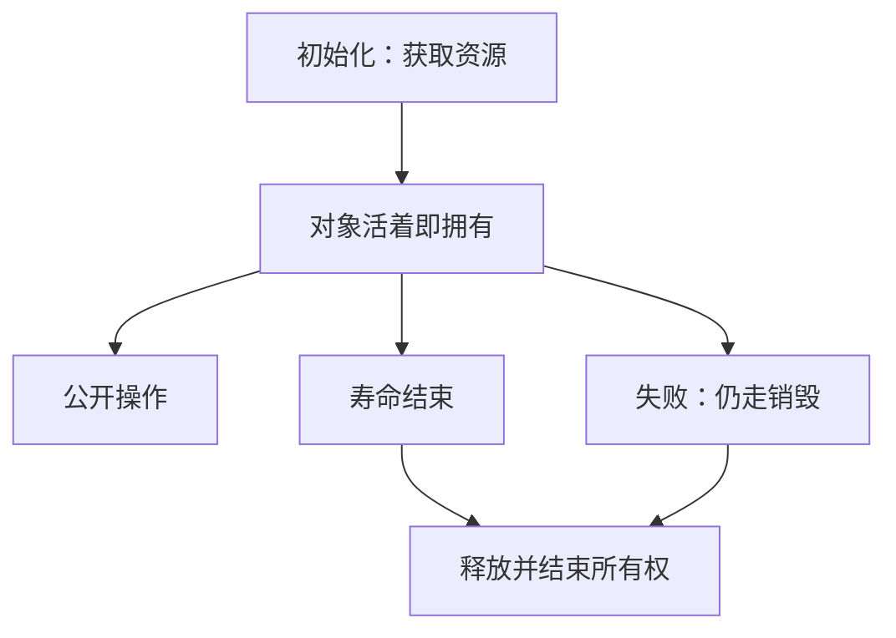

# 资源获取即初始化

谁获取资源，谁在对象寿命结束时释放；把获取写进初始化、把释放写进收尾，失败路径才不会漏。

<footer>—— 据 ISO/IEC 9899；Kernighan & Ritchie, The C Programming Language, 2nd ed. 整理</footer>

上一课[动态分派与虚表](/cs/vtable-preview)让销毁可以走表项。本课不重讲间接调用，也不从 C++ 教材名词另起。缺口是：错误码课已经要求失败时回滚，悬挂课已经要求 `free` 配对——**怎样让「获取与释放」跟对象寿命自动对齐**，而不是在每一条 `return` 上抄一遍。

## 问题

文件描述符、堆块、锁、映射区都是资源：获取成功后必须有人释放，否则泄漏；释放后必须无人再使用，否则悬挂。缺口因此不是再列 API，而是**把资源的寿命绑定到某个对象的寿命**。该对象初始化失败则资源未获取；初始化成功则销毁（或显式 `close`）一定会走到。C 没有析构语法，但同一纪律可以用结构体加唯一销毁函数、或 `goto cleanup` 单一出口来实现。

RAII 这个名字来自 C++：构造获取，析构释放，栈展开也会跑析构。本栏用它指纪律，而不是引入异常。单出口清理在 C 里是同一思想的手工版。测试失败路径时，应能断言：错误返回后无泄漏、无双释放。

### RAII 不是垃圾回收

垃圾回收回收的是内存，时机不确定，也不自动关闭套接字。RAII 是确定性的：对象寿命结束即释放，包括栈上自动对象离开作用域。把两者混成「都不用管释放」，会在描述符和锁上泄漏。C 里没有自动析构，更要把销毁函数当成公开契约的一部分。

ISO C 只提供寿命，不提供析构钩子。K&R 的程序靠纪律配对 `fopen`/`fclose`。本课把那条纪律提升为对象边界上的不变量：活对象拥有资源，死对象不再拥有。

## 方法

每个拥有资源的类型：创建函数内部获取，失败则释放已拿到的部分并返回错误；销毁函数释放全部并结束对象寿命。调用方不直接 `free` 内部指针。需要提前释放时只走销毁，不提供第二条路径。栈上的包装可以用一个带销毁语义的辅助，在函数所有 `return` 前调用——单一 `cleanup` 标签是常见写法。

所有权转移（创建者把对象交给调用方）必须在契约里写明：此后由接收者销毁。禁止两边各 `free` 一次。这与函数边界课的所有权声明是同一句话，现在落到资源上。

文件、锁、映射区比堆块更不能靠进程结束来「顺便清」：长期进程会先耗尽描述符。把它们绑到对象，才能在早返回、错误码、将来可能的线程取消上共用一个销毁点。C++ 异常展开会跑析构，C 没有这条；因此本栏不把异常当默认失败通道。测试应当在失败注入后查描述符与堆的余额，而不仅查返回码。后课共享可变会禁止两个对象同时拥有同一描述符而不声明协议。

## 机制

绑定之后，失败路径不再是特殊的漏扫：任何离开活状态的出口都经过同一释放。泄漏变成「创建成功却未把所有权交给任何人」，双释放变成「两个主人」。封装保证调用方碰不到内部句柄去提前 `close`。后课共享可变会问：两个线程各以为自己是主人时，这条绑定如何被打破——本课先在单线程把主人唯一钉死。

C++ 析构让这条纪律由编译器在每个作用域出口插入调用；C 必须把出口收敛。`goto cleanup` 不是风格落后，是在没有析构时维持唯一释放点。早 `return` 散落各处时，新加的资源获取几乎必然漏一条路径。测试失败注入的价值正在于逼出这些路径。所有权转移（把已初始化对象交给调用方）之后，创建者不得再销毁——双主人比无主人更接近双释放。共享可变课会问两个指针同时当主人怎么办；本课的答案是：那时已经不是 RAII，而是共享。

## 边界

本课不讲智能指针图，不讲循环引用。下一课[并发之前：共享可变](/cs/shared-mutable-preview)讨论多个名字同时写同一对象。后课默认：资源有唯一主人；创建与销毁配对；失败与成功出口都经过释放。

## 小结

- 资源寿命绑到对象寿命：初始化获取，结束时释放。
- C 用唯一销毁函数或单一清理出口模拟，而不是靠垃圾回收。
- 所有权转移必须在契约上换主人，禁止双释放。
- 下一课看多个可变别名如何在并发之前就毁掉不变量。
- 出处：ISO C 对象寿命；K&R 对 `fopen`/`fclose` 的配对；RAII 作为纪律而非语法。
