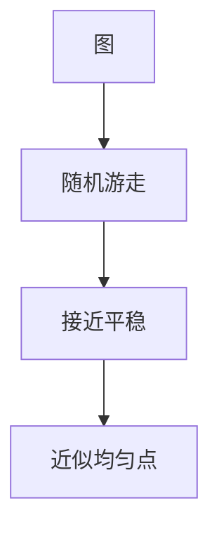

# 随机游走与混合时间

图上随机游走的分布趋向平稳；混合时间由谱隙或电导控制，抽样与连通判定共用这套。

<footer>—— 据 Aldous–Fill；Levin, Peres and Wilmer, Markov Chains and Mixing Times；Motwani and Raghavan 整理</footer>

上一课[指纹](/cs/fingerprinting-freivalds)是一次随机映射。本课过程：顶点上的马尔可夫链。缺口是混合时间：多久接近 $\pi$。不重写期望 DP 方程（那是吸收期望）。后课在线竞争比换模型。接[图流](/cs/graph-streaming)只点名，本课随机访问图。

## 问题

正则无向图：$\pi$ 均匀。转移 $P=AD^{-1}$。谱隙 $1-\lambda_2$ 越大混合越快。电导 $\Phi$（瓶颈）$\le$ 谱隙相关（Cheeger）。覆盖时间 $O(n^3)$（一般图 Rodeh/Aleliunas 等 $O(n m)$ 级）。2-SAT 随机游走多项式点名。

缺口是混合，不是 Karger 收缩。

### 不是物理布朗运动课

离散图。连续时间链点名。不要写随机微分方程。

混合时间教材 Levin–Peres–Wilmer。Aldous 覆盖时间。后课在线算法没有平稳分布。

## 方法

要抽样：走 $t_{\mathrm{mix}}$ 步。要连通：覆盖或 UST（Wilson）点名。谱：幂法估 $\lambda_2$ 不在本课展开。

懒惰链避免周期。

## 机制

总变差 $\|P^t(x,\cdot)-\pi\|_{\mathrm{TV}}$ 指数衰减，率谱隙。瓶颈集使混合慢（两团连一桥）。与期望到达：混合后才「忘起点」；到达期望可很长。与 expander：谱隙大，混合 $\log n$。

## 边界

本课不证 Cheeger 全不等式。不写 MCMC 统计物理。后课默认：随机游走混合由谱隙/电导管。下一课在线算法与竞争比。

## 小结

- 混合时间 = 忘起点、近平稳。
- 谱隙与电导；瓶颈则慢。
- 覆盖时间另一度量。
- 出处：Levin, Peres, Wilmer；Motwani–Raghavan。
