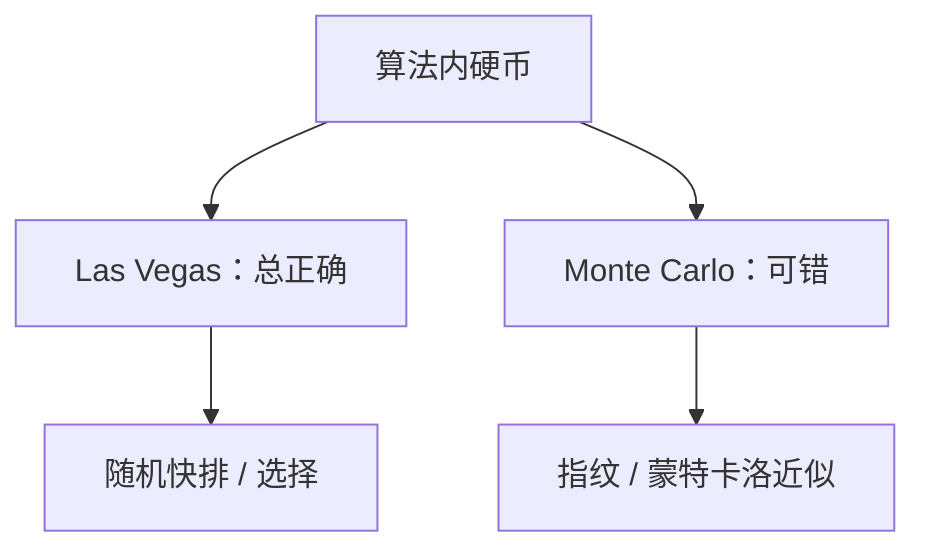

# 随机化算法直觉

硬币可以写进算法：Las Vegas 永远对、时间是随机变量；Monte Carlo 限时、以小概率错。

<footer>—— 据 CLRS 第 5、7、34 章；Motwani and Raghavan, Randomized Algorithms, 1995 整理</footer>

上一课[近似比](/cs/approximation-ratio)的 $\rho$ 是确定性最坏倍数。[快排与期望](/cs/quicksort-expected)已经用过算法内的硬币。本课不重做指示器求和。缺口是把随机化收成算法课的出口：两类错误、指纹与抽样、以及「期望多项式 / 高概率」与 NP 证书的关系。下一课起对象换成源程序字符串，不再抛硬币解图。

## 问题

确定性最坏可能平方或指数，随机打乱或随机轴把对手的输入洗成期望好。Las Vegas：输出总正确，如随机快排、随机选择；分析 $E[T]$。Monte Carlo：可能错，如指纹判相等（多项式哈希碰撞）、随机化 Miller–Rabin 一类数论测试——本课点名素性，不写数论证明。缺口是分类，不是再证快排。

近似也可以随机：期望比或高概率比。与上一课确定性 $\rho$ 并列，不要混成「差不多」。RP、BPP 是复杂度类名字，本课点到：多项式时间 Monte Carlo 一边错；不把 $P\stackrel{?}{=}BPP$ 当定理。

### 期望不是平均输入

上一课快排已强调：硬币在算法里，输入可以任意固定。本课沿用。平均情形分析（输入分布）是另一模型，不在主干。

Motwani–Raghavan 教材是随机算法标准书。CLRS 用指示器、随机增量、指纹。Karger 最小割等点名不展开。指纹与[散列](/cs/hash-function)同一碰撞语言。

## 方法

写清：错在哪一侧（否实例被当成是，或反之）、重复独立试验如何把错误指数压下去。期望线性选择、随机快排作 Las Vegas 例；指纹作 Monte Carlo 例。推导用线性期望，不必浓度不等式全文。

[离散概率](/cs/discrete-probability)已有期望线性。本课只把算法类型接上去。

## 机制

去随机化（条件期望、有限独立）可以把部分硬币拿掉，本课不写完。NPC 搜索没有已知的随机多项式精确算法；随机化不自动把 3-SAT 放进 P。编译课的哈希词法、布局随机化（ASLR）是后课系统，不是本课的图算法。

## 边界

本课不证 Chernoff 全文，不引入 PCP。不把密码学原语当随机算法习题。算法栏到此：图、串、范式、难解、近似与硬币都已开口。后课默认：随机化要声明 Las Vegas 还是 Monte Carlo。编译器通行证接源文本——字符串，不是随机图。

## 小结

- Las Vegas 正确、时间随机；Monte Carlo 可错、可重复压错误。
- 硬币在算法内；不代替 NP 证书。
- 算法课收束；下一课编译管道从字符开始。
- 出处：CLRS 第 5、7 章；Motwani and Raghavan, 1995。
