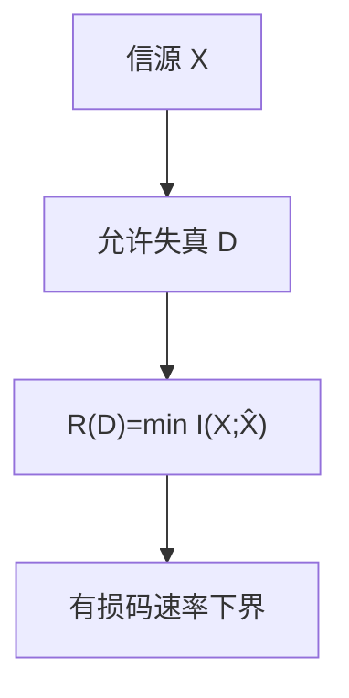

# 率失真

允许平均失真 $\le D$ 时，每符号最少仍要约 $R(D)=\min I(X;\hat X)$ 比特；$D=0$ 退回熵，JPEG 一类有损从这里量。

<footer>—— 据 Shannon, 1959；Cover and Thomas 整理</footer>

[上一课](/cs/ldpc-turbo)把逼近容量的码钉到直觉。无损路径从信源定理到 LZ、信道从容量到 LDPC。缺口是**有损**：像素不必精确复原。率失真函数 $R(D)$。本课钉定义与高斯例子，不写编解码器。

## 问题

失真 $d(x,\hat x)$（平方、汉明）。$R(D)=\min_{p(\hat x|x):\ \mathbb{E}d\le D}I(X;\hat X)$。$D=0$ 且 $d$ 为汉明时 $R(0)=H(X)$。高斯、平方失真：$R(D)=\frac12\log(\sigma^2/D)$（$D\le\sigma^2$）。反向：给速率 $R$ 能达到的最小失真。存在性仍随机码；JPEG 量化是启发式逼近，不是 $R(D)$ 的证明。

与容量：信道是固定 $p(y|x)$ 选 $p(x)$；率失真是固定 $p(x)$ 选「试验信道」$p(\hat x|x)$。对偶。

### 失真不是「看起来差不多」

必须先约定 $d$。感知上好的图可能平方误差大。本课不进视觉模型。

Shannon 1959 率失真。Cover–Thomas 第 10 章。Berger 的书。本课不证着色、高分辨近似全文。

## 方法

画 $R(D)$ 下降曲线。指出：量化器 + 熵编码是实践上界，未必等于 $R(D)$。向量量化以块逼近。不要把压缩比写成 $R(D)$——缺 $D$ 的数。

## 机制

信息单元的无损/有噪/有损三块至此齐：下界分别是 $H$、$C$、$R(D)$。下一课 KL 把「用错模型」的额外比特钉成相对熵，给交叉熵与最大熵铺路。

$R(D)$ 不可计算一般形式；构造性仍难。本课当尺子。

反向水灌：高斯独立分量把速率分给方差大的轴。高分辨量化：$R(D)\approx h(X)-\log D+$ 常数。实践：变换 + 量化 + 熵编码给出 $R(D)$ 的上界。没有 $d(\cdot,\cdot)$ 的数，谈不上「压了多少信息」。

## 边界

本课不写 JPEG 标记，不引入感知编码标准。不把大模型的重建损失当 $R(D)$。后课默认：有损的信息下界是 $R(D)$。下一课 KL 与交叉熵。

$D=0$ 回到无损 $H$；允许失真后 $R(D)$ 下降。没有事先约定的 $d$，有损比没有信息论意义。实践编解码是上界，高斯平方给出少数闭式。

上一课留下的缺口在本课收口；「率失真」进入后课词汇表后只引用。文献用来钉对象与边界，不把本课写成该主题的独立综述。

## 小结

- $R(D)$ 是失真 $D$ 下的最小互信息速率。
- $D=0$ 回到无损熵；高斯平方有闭式。
- 实践编解码给出上界，不是定义。
- 出处：Shannon, 1959；Cover and Thomas。
