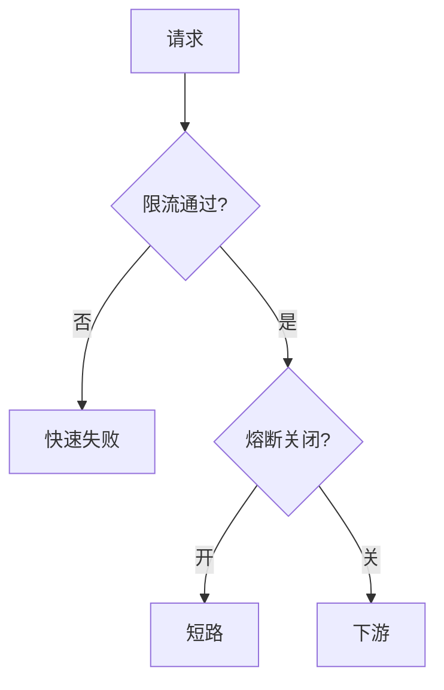

# 限流与熔断

限流挡住过量好请求；熔断在下游已病时拒绝新请求，避免重试把病机打死。二者都是负载的负反馈，不是业务正确性。

<footer>—— 据 Netflix Hystrix 设计；token bucket / leaky bucket 经典控制；Dean 对过载的讨论整理</footer>

上一课[雪崩与热键](/cs/cache-stampede-hotkey)仍可能打穿。缺口是**保护面**：即使单飞，总量仍可超过存储。本课钉限流与熔断，不重写填充租约。后课超时退避说明熔断打开期间重试如何把闭环做坏。

## 问题

限流：令牌桶、漏桶、滑动窗口，按键、用户、分片配额。超限快速失败，保护的是被调用者。熔断：统计错误率或延迟，打开后短时间短路，半开探测。Nygard 的《Release It!》把熔断当稳定模式；Hystrix 做成库。

缺口：限流在调用方还是网关。只在一端，另一端仍可被别的客户端打满。熔断若按错误率，下游限流返回的 429 会被当成故障而打开——策略要区分过载与真故障。

令牌桶允许短突发；漏桶平滑。选哪一种是产品对突发的态度，不是定理。

## 方法

分层：边缘限流（用户）+ 服务间限流（依赖配额）+ 熔断（依赖健康）。配额要按分片，避免热用户占满全局桶。熔断窗口与半开探测并发数要小，防探测雪崩。

不要用熔断替代[超时](/cs/timeout-backoff)：无限等会让错误率统计失真。

## 机制

过载崩溃：队列满、GC、线程池耗尽。熔断把失败从「超时 30s」变成「立即」，释放调用方资源。这与[尾延迟](/cs/tail-latency-hedging)相关：长尾占满池子。限流是主动掉请求保平均数；熔断是下游已掉时停止喂食。

分布式限流：中心计数器是热点；本地近似桶会超卖。超卖多少要进规格。本课不把 Redis INCR 当完备分布式桶证明。

本课不写 HTTP 429 的全部头。也不写电力断路器物理课。

## 边界

本课不把自适应并发控制（TCP Vegas、CoDel、adaptive LIFO）写全，点名即可。后课默认：依赖调用有配额与熔断；429 与 5xx 分开计数。超时退避下一课处理「失败后何时再试」，否则熔断永远被重试撬开。

保险丝保护的是系统，不是这次用户请求的恰好一次。

## 小结

- 限流：配额内才放行；熔断：下游病则短路。
- 429 与故障要分开，以免误打开。
- 桶可超卖若只在本地近似。
- 出处：Hystrix；令牌桶；Nygard 稳定模式。
