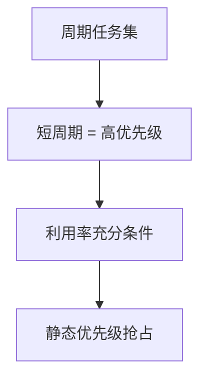

# 速率单调

周期越短优先级越高：在独立、可抢占、截止等于周期的假设下，利用率不超过 $n(2^{1/n}-1)$ 则速率单调可调度。

<footer>—— 据 Liu and Layland, Scheduling Algorithms for Multiprogramming in a Hard-Real-Time Environment, JACM 1973</footer>

[上一课](/cs/realtime-sched)对照了公平份额与期限，并点名 RM 与 EDF。缺口是把 **RM** 收成可检查的规则：静态优先级按周期（速率）指定，短周期高优先级，以及 Liu–Layland 利用率界限。本课不把响应时间分析（RTA）的迭代公式写完。

## 问题

一组周期任务 $\tau_i=(C_i,P_i)$，$D_i=P_i$，独立、可抢占、无锁。要不要在运行时比较截止？RM 说不必：离线按 $P_i$ 排序即可。缺口不是再定义硬实时，而是这条静态赋值以及充分条件 $\sum C_i/P_i \le n(2^{1/n}-1)$（$n\to\infty$ 时约 $0.69$）。超界仍可能可调度，那是充分非必要。

调和周期（一个周期是另一个的整数倍）时界限可放到 1。教学先记一般界限，再承认特例更宽。

## 方法

指定优先级： $P_i<P_j \Rightarrow \tau_i$ 高于 $\tau_j$。运行：总是跑当前最高优先级的就绪周期任务，与[运行队列](/cs/runqueue)的优先级槽一致。利用率测试作快速拒绝；要精确可用关键瞬间：所有任务同时释放时的最坏。本课不把关键瞬间证明展开。

与 CFS 并存时，RM 队列必须先于公平队列，对照课已说。

## 机制

RM 最优在「静态优先级」类中（Liu–Layland 假设下）：若某静态赋值可调度，则 RM 也可。它不处理共享锁的反转——那要用[PI](/cs/pi-pcp)。切换税与 ISR 必须打进 $C_i$，否则纸上可调度、板上逾期。这把内核抢占与中断线程化接到期限上。

## 边界

本课不把偶发任务、前馈抖动写成完整 Sporadic Server。也不声称桌面 Linux 的 `SCHED_FIFO` 自动等于 RM：那只是固定优先级，周期要用户自己对齐。EDF 的动态截止与界限 1 是下一课。

后课默认：静态期限调度用 RM。若允许运行时谁更急谁跑，下一课 EDF。

## 小结

- RM：周期越短优先级越高；利用率 $n(2^{1/n}-1)$ 是充分条件。
- 静态类中最优（经典假设下）；锁与 ISR 另计。
- 动态最早截止是下一课。
- 出处：Liu and Layland, *JACM* 1973。
