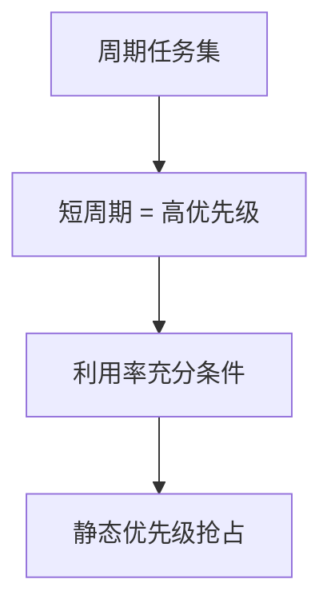
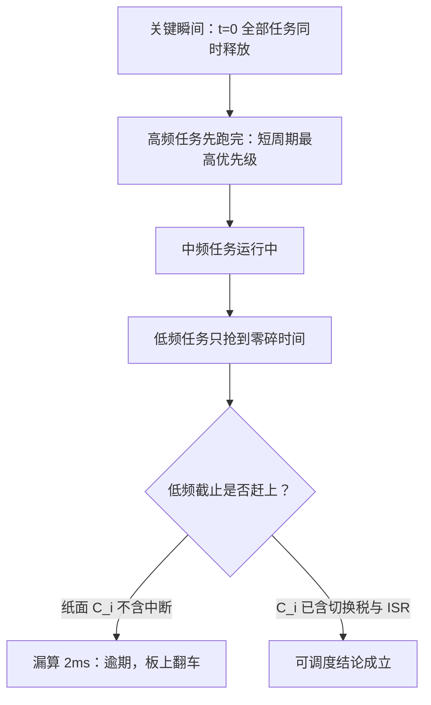

# 速率单调

周期越短优先级越高：在独立、可抢占、截止等于周期的假设下，利用率不超过 $n(2^{1/n}-1)$ 则速率单调可调度。

<footer>—— 据 Liu and Layland, Scheduling Algorithms for Multiprogramming in a Hard-Real-Time Environment, JACM 1973</footer>

[上一课](/cs/realtime-sched)对照了公平份额与期限，并点名 RM 与 EDF。缺口是把 **RM** 收成可检查的规则：静态优先级按周期（速率）指定，短周期高优先级，以及 Liu–Layland 利用率界限。本课不把响应时间分析（RTA）的迭代公式写完。

## 问题

一组周期任务 $\tau_i=(C_i,P_i)$，$D_i=P_i$，独立、可抢占、无锁。要不要在运行时比较截止？RM 说不必：离线按 $P_i$ 排序即可。缺口不是再定义硬实时，而是这条静态赋值以及充分条件 $\sum C_i/P_i \le n(2^{1/n}-1)$（$n\to\infty$ 时约 $0.69$）。超界仍可能可调度，那是充分非必要。

数字实例：界限随任务数变化。$n=1$ 时 $2^{1}-1=1$（单任务可跑到 100%）；$n=2$ 时 $2(\sqrt2-1)\approx 0.83$；$n=3$ 时约 $0.78$；$n=10$ 时约 $0.72$。也就是说任务越多，这个「闭眼判可调度」的门槛越低，但永远不低于约 69%。

调和周期（一个周期是另一个的整数倍）时界限可放到 1。教学先记一般界限，再承认特例更宽。

## 方法

指定优先级： $P_i\lt P_j \Rightarrow \tau_i$ 高于 $\tau_j$。运行：总是跑当前最高优先级的就绪周期任务，与[运行队列](/cs/runqueue)的优先级槽一致。利用率测试作快速拒绝；要精确可用关键瞬间：所有任务同时释放时的最坏。本课不把关键瞬间证明展开。

```mermaid
flowchart TD
  T["周期任务集"] --> PRI["短周期 = 高优先级"]
  PRI --> TEST["利用率充分条件"]
  TEST --> RUN["静态优先级抢占"]
```

与 CFS 并存时，RM 队列必须先于公平队列，对照课已说。

常见误区：初学者容易把「利用率超过 $n(2^{1/n}-1)$」读成「必然错过截止」。界限只是充分条件——它是快速拒绝用的筛子，筛不掉不代表过不了精确分析。两个周期 10ms、执行 6ms 的任务利用率 1.2 当然不行，但 0.8 的任务集也完全可能 RM 可调度。

## 机制

RM 最优在「静态优先级」类中（Liu–Layland 假设下）：若某静态赋值可调度，则 RM 也可。它不处理共享锁的反转——那要用[PI](/cs/pi-pcp)。切换税与 ISR 必须打进 $C_i$，否则纸上可调度、板上逾期。这把内核抢占与中断线程化接到期限上。

```mermaid
flowchart TD
  R["关键瞬间：t=0 全部任务同时释放"] --> H["高频任务先跑完：短周期最高优先级"]
  H --> M["中频任务运行中"]
  M --> L["低频任务只抢到零碎时间"]
  L --> Q{"低频截止是否赶上？"}
  Q -->|"纸面 C_i 不含中断"| A["漏算 2ms：逾期，板上翻车"]
  Q -->|"C_i 已含切换税与 ISR"| B["可调度结论成立"]
```

为什么重要：这一步做错了，后面整个静态分析都会作废。设每毫秒来一次 20 微秒的中断，若不把它摊进各任务的 $C_i$，10ms 周期的任务一个周期就凭空多担 0.2ms——利用率被系统性低估，样机不忙、量产超期。实时工程的第一课是：测到的执行时间必须含税。

## 边界

本课不把偶发任务、前馈抖动写成完整 Sporadic Server。也不声称桌面 Linux 的 `SCHED_FIFO` 自动等于 RM：那只是固定优先级，周期要用户自己对齐。EDF 的动态截止与界限 1 是下一课。

后课默认：静态期限调度用 RM。若允许运行时谁更急谁跑，下一课 EDF。

## 小结

- RM：周期越短优先级越高；利用率 $n(2^{1/n}-1)$ 是充分条件。
- 静态类中最优（经典假设下）；锁与 ISR 另计。
- 动态最早截止是下一课。
- 出处：Liu and Layland, *JACM* 1973。
