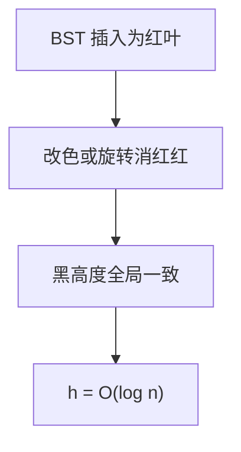

# 红黑树直觉

用红黑两色约束路径上的黑高度，不必让每一层左右高度只差 1；旋转次数更稳，对数高度仍在。

<footer>—— 据 Guibas and Sedgewick, A Dichromatic Framework for Balanced Trees, FOCS 1978；Cormen, Leiserson, Rivest and Stein 整理</footer>

[上一课](/cs/avl-rotate)用严格高度差和旋转把 $h$ 钉在对数。实践中库常用更松的结构：插入最多常数次旋转。[二叉查找树](/cs/avl-rotate)不变式仍要满足。本课不重讲 LL/RR 四种图。缺口是红黑直觉：颜色 + 黑高度，从而最坏仍 $\Theta(\log n)$，插入修复更局部。不把 CLRS 第 13 章每一种 case 抄成词条。

## 问题

AVL 每次插入都可能沿路径更新平衡因子并旋转，删除更甚。需要一种平衡，使「树不会退化成链」但允许左右高度差到常数倍。缺口不是新的键序，而是**额外一比特颜色**加上几条全局规则，推出最长路径不超过最短的两倍。

规则直觉：根黑；红节点的孩子黑（没有连续红）；任意节点到叶的黑节点数相同。叶可以是 NIL 黑哨兵。本课用这些推出高度界，不写完插入着色的全部分支。

2-3-4 树与红黑同构是常见对照：红边把 3、4 节点拆成二叉。本课点名，不把 B 树提前讲完。

## 方法

黑高度 $bh$：从该点到叶的黑节点数（不含自身或含，须一致）。无连续红 ⇒ 红节点把路径拉长至多一倍 ⇒ $h\le 2bh$。全黑路径最短，$n$ 至少随 $bh$ 指数涨 ⇒ $h=O(\log n)$。

插入先当 BST 红叶挂上，再沿路径改色或旋转，消除红-红。旋转仍是上一课那一对。删除更繁，本课只承认存在 $\Theta(\log n)$ 算法。

## 机制

合同与 AVL 相同：有序字典最坏对数。差别在常数：红黑插入旋转 $O(1)$ 次（另加 $O(\log n)$ 改色），AVL 更扁。语言标准库的 `map` 常选红黑，因为插入删除与查找折中。

颜色是表示的一部分，不是键。中序序列仍完全由 BST 不变式决定。改色不改变形状，旋转才改变高度；两者配合才恢复规则。

## 边界

本课不证明插入全部 case 的正确性，不引入 AA 树、替罪羊树。伸展树用摊还、无额外平衡位，是另一合同。外存上二叉节点太瘦，下一课 B 树把扇出加大。

后课默认：内存有序字典可以当红黑用，最坏 $\Theta(\log n)$。磁盘上比较次数要按页算。

## 小结

- 红黑用颜色约束黑高度，路径长至多差一倍，故对数高。
- 旋转原语与 AVL 相同；插入修复更局部。
- 外存需要高扇出，下一课 B 树。
- 本课不把插入全部着色 case 写成词条；合同已是最坏对数。
- 出处：Guibas and Sedgewick, *FOCS*, 1978；Cormen et al. 第 13 章。
