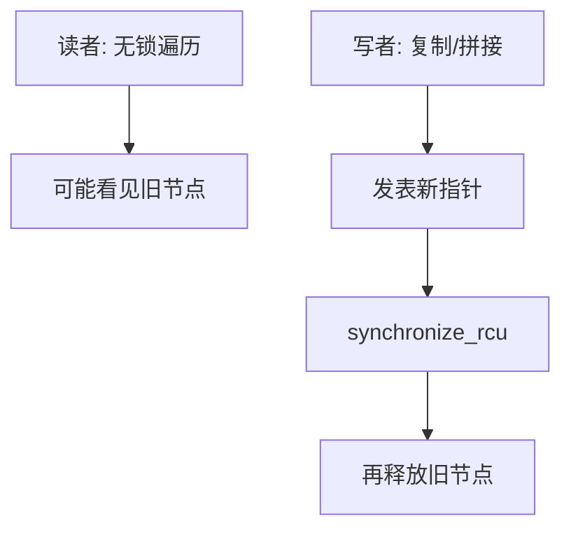

# RCU 友好的结构

读者不取锁：只记已进入读侧临界区。写者复制或拼接新结构，宽限期过后再释放旧节点。

<footer>—— 据 McKenney and Slingwine, Read-Copy Update: Using Execution History to Solve Concurrency Problems, PDCS 1998；McKenney, RCU 系列文献；[RCU 宽限期](/cs/rcu-gp) 整理</footer>

[上一课](/cs/concurrent-hashmap) 的 get 仍常碰原子或桶锁。[RCU 宽限期](/cs/rcu-gp) 已定义 GP。[路径复制](/cs/persistent-path-copy) 提供写复制图像。本课不 Treiber。缺口是哪些结构适合 RCU：单向链表、基数树、哈希链——读者遍历，写者 `rcu_assign_pointer`。

## 问题

读远多于写（路由表、配置、目录）。锁读者会互撞。RCU：读侧 `rcu_read_lock` 几乎是关抢占或记状态；写者做 copy-update，发布新指针，`synchronize_rcu` 等所有读者离开旧视图。缺口是**结构必须允许「旧新并存」直到 GP**：不能原地改读者正扫的字段除非小心（或只用追加）。

McKenney–Slingwine 1998。内核哈希桶、`list_replace_rcu` 是实例。用户态 urcu 同构。

## 方法

链表删除：摘指针发表，GP 后 free。更新：新节点填好，CAS 或锁下改前驱 next。树：写路径复制或 COW 根。哈希表：桶链 RCU，扩容仍难，常读锁写或分层。

与 HP：RCU 读侧更轻，写侧延迟更大、要能停或异步回调。与 HAMT 持久：语义像无限版本；RCU 通常只保到 GP 的读者。

## 机制

内存屏障：发表前写节点字段。读者遍历要用 `rcu_dereference`。本课不重开调度器。分配器下一课：RCU 延迟释放会给分配器压力，与空闲链结构有关。

## 边界

本课不把内核 API 清单当正文。写多读多仍用锁或无锁表。不要用 RCU 保护任意图的随便原地改。

后课默认：读多链表/树可用 RCU 发表。分配器自身的空闲结构下一课。

## 小结

- RCU 结构：读者无锁，写者发表，GP 后回收。
- 适合链表、某些树与哈希链；原地改受限。
- 下一课分配器内部空闲结构。
- 出处：McKenney and Slingwine, 1998；McKenney RCU 文献。
