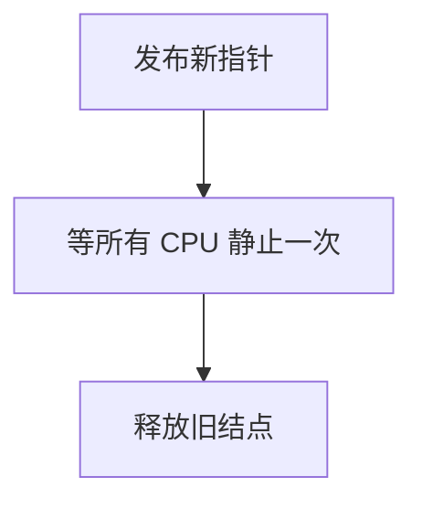

# RCU 宽限期

宽限期结束，意味着开始等待之后启动的每个 CPU 都已经过了一次静止状态——于是那时还活着的 RCU 读者都已离开。

<footer>—— 据 McKenney, RCU 实现与《Is Parallel Programming Hard》中对 grace period 的整理</footer>

[上一课](/cs/rcu-read)禁止在读侧释放旧结点。缺口是检测「世界上没有读者还拿着旧指针」：**grace period（宽限期）**。写者 `synchronize_rcu` 阻塞到一个宽限期结束，或 `call_rcu` 把释放挂到结束后的回调。本课钉静止状态直觉，不当成内核源码。

## 问题

不能给每个读者发票再回收：那等于又一把读锁。RCU 用 CPU 的静止：不在 `rcu_read_lock` 区间内（对抢占 RCU：该核上读侧嵌套为零）。若每个 CPU 都经历过一次静止，则任何在宽限期开始前已进入的读者都已退出——因为读者不可睡、不可被迁走而一直占着读侧（经典模型）。缺口不是再写 `rcu_dereference`，而是这条**全局静止论证**。

`synchronize_rcu` 可能等若干毫秒，写路径不能在硬 IRQ 里做。`call_rcu` 把 free 推迟到软中断或工作队列。

## 方法

写者发布新指针（release）后，等待宽限期，再 `kfree` 旧结点。实现：每 CPU 记 qs 位，时钟或上下文切换报告静止，协调者收集全 1 则 GP 结束。多个写者可共享同一 GP。与[idle](/cs/idle-thread)：idle 通常算静止，否则空闲核会挡住回收。

与[completion](/cs/completion) 不同：不是等一个生产者，而是等所有可能读者的核过静止。

## 机制

宽限期把内存回收延迟变成可证明的安全点。它是写者的税、读者的零税。过长的读侧临界区拖长 GP，表现为内存峰值——纪律仍是读侧要短。抢占 RCU、SRCU 改静止定义，本课只要求：释放前必须经过实现所承认的 GP。

NMI 中的读者要用特殊登记，否则静止检测看不见它们；点到即可。

## 边界

本课不把 Expedited GP 的 IPI 风暴写成运维事故分析，不列举所有 `rcu_barrier` 语义。无锁 CAS 循环另有 ABA，下一课。也不把 GC 分代与 RCU 混成一种运行时。

后课默认：RCU 释放发生在宽限期后。无锁结构用 CAS 换头时，节点被复用会对 CAS 撒谎，下一课 ABA。

## 小结

- 宽限期：所有 CPU 静止过一次 ⇒ 旧读者已离开，可释放。
- 写者付延迟；读侧过长会拖回收。
- 无锁 CAS 的 ABA 是下一课。
- 出处：McKenney，RCU 文献与 *Is Parallel Programming Hard, and, If So, What Can You Do About It?*。
