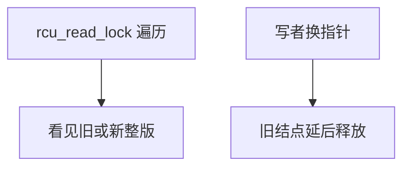

# RCU 读者

读—拷贝—更新让读者在没有任何锁的路径上遍历结构；写者改的是新副本，旧副本要等所有读者离开后再释放。

<footer>—— 据 McKenney and Slingwine, Read-Copy Update, 1998 起；McKenney, What Is RCU, Fundamentally? 整理</footer>

[上一课](/cs/completion)会合一次性事件，读者仍可能持锁或重试。[rwlock](/cs/rwlock) 读侧写计数；[seqlock](/cs/seqlock) 要求数据小可重试。缺口是内核链表、路由一类：**读者极多、不能失败、不能睡在读侧**，写者可另做副本。本课只钉读者规则：`rcu_read_lock` 区间内指针仍有效。宽限期下一课。

## 问题

读者若拿 rwlock，缓存行与延迟都回去了。RCU 读者：关抢占（或等价地声明读侧临界区），用 `rcu_dereference` 加载指针，遍历。写者：拷贝结点、填新数据、`rcu_assign_pointer` 把链表指针改到新结点，旧结点先不释放。缺口不是 completion 的粘性位，而是**读侧零原子、零失败**，正确性靠「没有读者还拿着旧指针」这一事后条件。

读侧临界区不能睡眠（普通 RCU）。否则宽限期无法结束。SRCU 允许睡，代价另一套，主干先记不可睡。

## 方法

读者：`rcu_read_lock(); p = rcu_dereference(gp); ...; rcu_read_unlock();`。在这之间，写者保证不释放读者可能拿到的对象。加载必须带依赖或 acquire，防止编译器把解引用提前——对接屏障课。写者互斥仍用 mutex/自旋保护「谁在改这棵结构」。

与[内核抢占](/cs/kernel-preempt)：读侧关抢占是常见实现，使「当前 CPU 过了静止点」可检测。

## 机制

读者永远看见一致的旧版或新版，不像 seqlock 那样中间态重试。写延迟转到「何时能 free」。多读者并行、不写共享锁字，这是 RCU 存在的理由。误用：在读侧外拿着指针去睡，再解引用——对象可能已释放。本课把这条当纪律，回收时机下一课。

## 边界

本课不把 `call_rcu` 的回调队列写完，不比较所有 RCU 变体。用户态 RCU 存在，主干以内核为准。无锁链表的 ABA 还没出场。

后课默认：读者在 RCU 临界区内指针有效。写者何时能释放旧对象，下一课宽限期。

## 小结

- RCU 读者无锁、不失败、不可睡（普通 RCU）。
- 写者换指针，旧对象先留着。
- 何时能 free 是宽限期课。
- 出处：McKenney and Slingwine；McKenney, *What Is RCU, Fundamentally?*。
