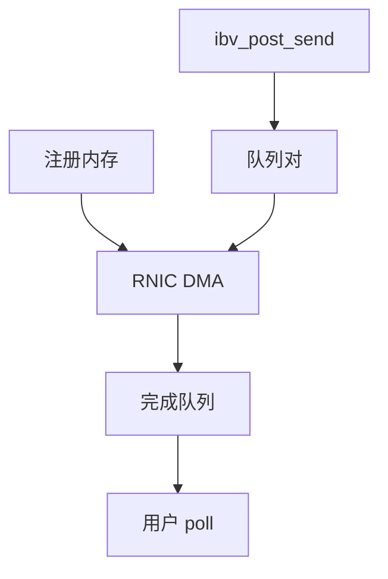

# RDMA 在 OS 中的位置

RDMA 把注册过的用户内存直接交给网卡 DMA，绕过 TCP 与套接字缓冲；内核只做连接、注册与完成队列的映射。

<footer>—— 据 InfiniBand/RDMA 规范直觉；Linux rdma-core 与 ibverbs 文档；RFC 5040 对 iWARP 的背景</footer>

[零拷贝](/cs/zero-copy-network) 仍常走 TCP。[DPDK](/cs/dpdk-kernel-bypass) 旁路的是整栈。缺口是 **RDMA 在 OS 里的位置**：verbs、MR、QP，以及它不是文件系统的 RDMA 导出百科。

## 问题

HPC/存储要微秒级、少拷贝。RDMA：进程注册虚址，卡拿到翻译（或 on-demand paging）；QP 成对，post send/recv 或 RDMA WRITE 不经过对端 CPU。缺口：内核模块（ib_core）管理设备，用户 libibverbs mmap 门铃；与 socket 并行存在，应用要改 API。本课不把 RoCE 拥塞控制写成传输课全文。

rping 一类工具只为证明路径。NVMe-oF RDMA 把块命令放在这套 QP 上，存储栈与网络在此汇合。

## 方法

打开设备 → PD → 注册 MR → 建 CQ/QP → 交换 QP 号（TCP 带外）→ post。完成：poll CQ，与 [NVMe](/cs/nvme-driver) 同构。对照 TCP：无 sk_buff 数据路径。对照 XDP：XDP 仍以太网；RDMA 是另一种 verbs 设备。

## 机制

OS 把「安全 DMA 窗口」当成一等资源（MR），把网络变成类似块设备的队列。内核不再逐字节解释流。不要写成量化超低延迟撮合。错误：pin 过多内存会伤页回收——[rmap](/cs/rmap) 后课会再遇钉页。

与 netns：RDMA 设备的 ns 支持不完整于普通网卡，部署要查清。

实现上：MR 钉页对抗回收，注册过多会让 compaction 失败。QP 状态错误只在 CQ 上看见，应用要把完成当 ABI。RoCE 丢包行为与 InfiniBand 可靠服务不同。 读法上只引用[上一课](/cs/zero-copy-network)的结论，不把对象换成训练推理或限价簿。

本课在操作系统进阶的「网络栈 / 收发路径」课序里，对象是 **RDMA 在 OS 中的位置**。

- 先修只引用，不重导：上一课的结论当公理，本课只补差。
- 五栏不吞并：不把本课写成大模型训练/推理，也不写成限价簿或权重量化。
- 文献用 OSTEP、McKusick、内核文档与具名会议论文；不发明 arXiv 编号。

## 边界

本课不引入全部 QP 状态图。不保证 Soft-RoCE 的性能。网络课序收口于「还有套接字选项这层旋钮」。下一课把 POSIX 套接字选项钉住，作为应用仍走内核 TCP 时的接口。

版本字段会变，课序钉的是机制对象「RDMA 在 OS 中的位置」，不是某一主线内核的结构体名。
后课默认：RDMA 用 verbs 与注册内存，不经 TCP 数据路径。普通套接字的选项如何改内核行为，下一课。

## 小结

- RDMA：内核管注册与 QP，数据 DMA 进用户 MR。
- 与 socket/DPDK/XDP 是不同接头。
- 套接字选项是下一课。
- 出处：rdma-core；InfiniBand 直觉；Linux RDMA。
