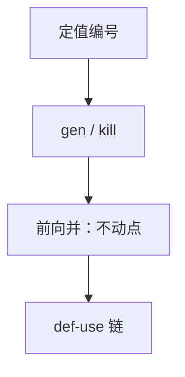

# 到达定义

定值 $d$ 到达点 $p$，当存在一条从 $d$ 到 $p$ 的路，路上 $d$ 所写的名字不被杀掉。这是向前的并汇合数据流。

<footer>—— 据龙书第 9 章整理</footer>

上一课[活跃变量与数据流](/cs/dataflow-liveness)用后向 `use`/`def` 钉了框架与冲突图入口，并声明到达定值向前、可用表达式另套 gen/kill。本课不重写活跃方程。缺口是**哪一次写**还能被这里读到：常量传播、未初始化使用、SSA 之前的 def-use 链，都靠到达。后课可用表达式把「算过且未被杀掉的表达式」换成交汇合。

## 问题

每条对 $x$ 的赋值是一个定值。`gen[B]`：块内最后写下的那些定值。`kill[B]`：被块内新写杀掉的、对同名的其他定值。方程：`in[B]=\bigcup_{前驱} out[P]`，`out[B]=gen[B]\cup(in[B]-kill[B])`。从空集迭代到不动点。与活跃相反：信息沿控制流正向走，汇合是并（任一路带来的定值都算到达）。

缺口是这套 gen/kill，不是再解释格。未初始化：入口虚构定值 $\bot$，若 $\bot$ 到达某次读，则可能未定义。SSA 上每个使用对应一条定值（φ 除外看成多条），到达分析几乎退化；本课覆盖非 SSA 与 SSA 前的 IR。

### 到达不是「必须到达」

并汇合是 may：存在一条路。必须到达要用交，那是另一分析。不要用到达去做「所有路都经过这次写」。

龙书 9.2.4 节到达定值。Kildall 的格框架上一课已点。常量传播把到达的唯一常量定值替换掉；多条定值到达则放弃。

## 方法

给每个赋值编号。算块的 gen/kill。正向迭代。指令级可再拆：每条指令后的到达集。复杂度与活跃同类：集大小 × 块数 × 轮数。

def-use：对每个使用，到达此处的该名定值列表。SSA 把列表长度压到 1（φ 的操作数分开）。

## 机制

死写：定值到达的使用集为空（且无副作用）可删——与活跃对偶。拷贝传播：到达的唯一 $x\leftarrow y$ 且 $y$ 未被改。本课点名，不写完全部改写规则。

指针别名使 kill 不精确：保守少杀，到达集偏大，优化变少，不错语义。

## 边界

本课不做可用表达式、不着色、不选指令。后课默认：能回答「哪些写到达这里」。可用表达式用交、问的是表达式而非定值编号，下一缺口。

## 小结

- 到达定值：前向、并、gen/kill。
- may 语义；未初始化用入口 $\bot$。
- SSA 使 def-use 变薄，分析仍对非 SSA 成立。
- 出处：Aho et al., 龙书第 9 章。
