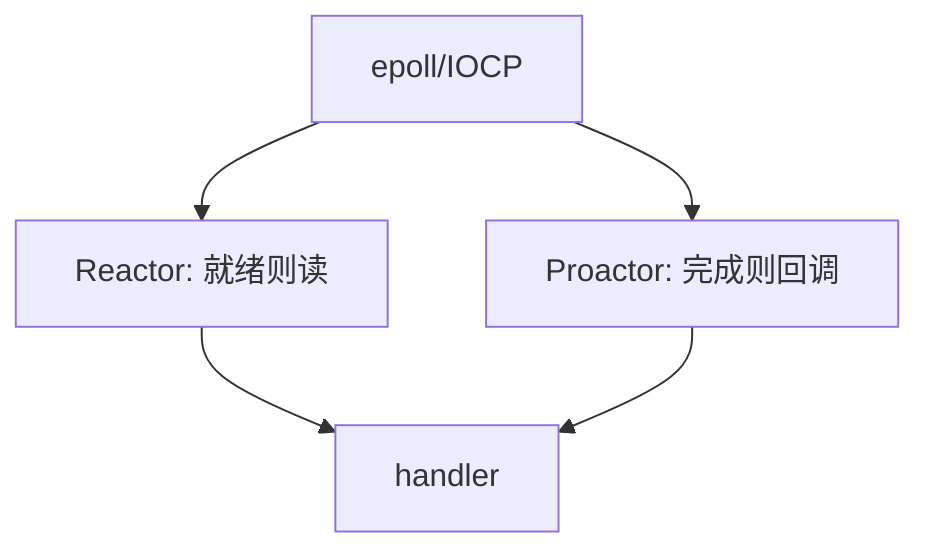

# Reactor / Proactor

Reactor 等就绪再同步读写；Proactor 把异步完成当事件。两者把「一线程一连接」换成事件循环，才能接近线速套接字。

<footer>—— 据 Schmidt, Reactor, POSA2；Proactor 模式对照；Stevens UNP 整理</footer>

主干[非阻塞套接字](/cs/socket-nonblock) 已给 O_NONBLOCK。[上一课](/cs/network-simulation) 不写主机程序。缺口是**事件分派模式**：select/epoll vs IOCP/io_uring。本课不把 C10K 数字写完。

## 问题

阻塞 `recv` 一连接一线程，万连接炸栈。[非阻塞](/cs/socket-nonblock) 要自己问谁就绪。Reactor：多路复用（epoll）→ 分派 handler → 非阻塞 I/O。Proactor：提交异步读，完成队列回调，数据已在缓冲。Linux 历史偏 Reactor，io_uring 靠向 Proactor。TSO/GRO 减事件次数。

不要把模式写成语言框架名。

POSA2 Reactor。本课不把每套 API 参数背完。

### I/O 线程必须短

就绪再读 vs 完成再回调。循环里阻塞 DNS 会冻整服务。重 CPU 应下到线程池。不是语言框架名。

## 方法

对照两种时序图。画：等待 → 就绪/完成 → 处理。与交换机：都是事件驱动，一层主机，一层 ASIC。

方法止于选定对象与对照；机制才说它如何嵌入已有分层与主干课。

## 机制

反向代理、QUIC 用户态栈都是这种循环。SSH 按键也是。线程池可放在 handler 后做业务，I/O 线程不阻塞——否则 Reactor 假死。与 PTP 无关。

安全：事件循环里不要做重 CPU，否则延迟像膨胀。

## 边界

本课不引入每种开源库。C10K 与并发模型是下一课。后课默认：高并发 I/O 用 Reactor 或 Proactor，不是一连接一线程。

在循环里再阻塞 DNS 查询会把整个服务卡住。

上一课留下的缺口在本课收口；「Reactor / Proactor」进入后课词汇表后只引用。文献用来钉对象与边界，不把本课写成该主题的独立综述。下一课[C10K 与并发模型](/cs/c10k-concurrency)。

## 小结

- Reactor 等就绪；Proactor 等完成。
- 多路复用是共同前提。
- I/O 线程必须短而非阻塞。
- 后课只引用本课钉死的对象，不从该领域总问题重开。
- 出处：Schmidt Reactor；UNP。
