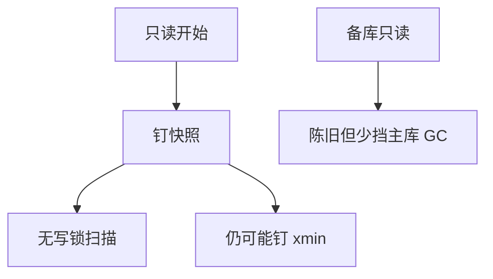

# 只读事务与快照

只读事务不安装写集，快照可在开始时钉死；读不阻塞写，但钉住的水位仍可能挡住 GC，除非快照被送到副本。

<footer>—— 据 Fekete 等 SI；Postgres REPEATABLE READ；异步备库只读</footer>

[上一课](/cs/mvcc-gc)把膨胀归到最小快照。本课专讲只读：主干隔离级别有只读优化。缺口是**声明只读**带来的协议变体：无写锁、无 OCC 验证写集、可在备库执行、可与 SSI 豁免交互。Calvin 下一课连写也确定性。

## 问题

读写事务的快照若在第一句才钉，可与 SI 异常相关；有的引擎事务开始即钉。只读：开始钉即可。缺口是一致性：只读要不要看见「自己开始后已提交的写」——不可重复读 vs 语句快照 vs 事务快照。分析查询要事务快照才可重复。

备库只读：物理复制延迟，读的是过去快照，GC 在主库若无 feedback 可不被备库查询钉住（备库自己 vacuum）。冲突：主库 replay 与备库查询锁行，hot standby 冲突。

只读优化不能改成脏读。读己之写在单机只读事务无写。分布式读己之写后课复制延迟。

## 方法

`BEGIN READ ONLY`：锁管理器不发 IX，优化器可选延迟物化与无间隙锁（在 SI 下）。导出快照 id 给其他连接（快照导入）做多会话一致读，水位仍钉。

HTAP：分析只读走列存副本，OLTP 走行存，快照由复制 LSN 对齐——后课 HTAP。

## 机制

计划：只读可串行在 SSI 下少 abort。并行工人共享同一快照号，否则各工人看见不同提交。exchange 课已要求。

与预编译：只读短查询仍走计划缓存；快照号每次新。

## 边界

本课不讲 Calvin 定序。也不把只读当最终一致 OK 的借口——合同要写陈旧预算。RTO 是恢复课。

后课默认：分析用事务快照只读；怕膨胀则走副本。Calvin 确定性：先全局定序再无锁执行，读写都适用。

只读不是隔离级别，是事务属性；与 RR/SSI 正交组合。

## 小结

- 只读钉快照、少锁；仍可能钉 GC 水位。
- 备库只读用延迟换主库膨胀。
- Calvin 确定性下一课：定序代替冲突检测。
- 出处：SI 文献；Postgres 只读/备库；Gray。
