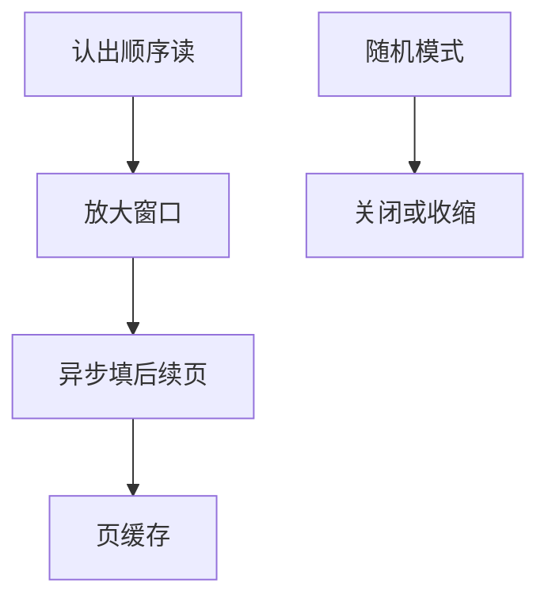

# 预读

顺序读一旦被认出，内核就在当前请求之后再拉若干页进页缓存，用带宽换掉下一次缺页。

<footer>—— 据 Paixao 等对 Linux readahead 的实现讨论；Arpaci-Dusseau, <em>OSTEP</em> 对预取的整理；McKusick 对簇读的背景</footer>

[上一课](/cs/device-nodes)已能打开块设备或文件。每次 `read` 若只填一页，HDD 与即便是 NVMe 也会把延迟付 N 次。[页缓存](/cs/page-cache) 的 miss 路径可以**多填**。缺口是预读窗口：何时放大、何时停、`fadvise` 如何提示。

## 问题

随机读预取会害：把有用页挤出，还占用设备队列。内核跟踪某文件描述的顺序程度，命中则把 readahead 窗口加倍，直到上限；探测失败则收缩。`posix_fadvise(WILLNEED/SEQUENTIAL/RANDOM)` 改策略。缺口：mmap 顺序扫描同样走异步预读；[稀疏](/cs/sparse-files) 洞不应把后面数据当顺序；`O_DIRECT` 绕过页缓存则本课对象不在。

窗口以页计，背后可能合并成一次大 I/O。预读是启发式，不是 POSIX 保证。本课不把 madvise 的全部体系写成虚存百科。

## 方法

`read` miss：提交当前页 I/O，同时对后续偏移 `readpages`。完成的页插入树，标 readahead 以便统计命中。写不预读。对照磁盘调度：预读制造顺序大请求，[块层](/cs/blk-schedulers) 更易合并——那是下一课序。对照 NFS：预读变成超前 READ RPC，语义仍受缓存约束。

## 机制

预读把「文件是流」的统计结构变成 I/O 形状：顺序工作负载接近设备带宽，随机工作负载不应被好心伤害。它不改变崩溃一致性，只改变热页集合。不要把预读写成 CPU 硬件预取器的同构课：缺的是毫秒级存储，不是纳秒级 cache line。

与 [mmap 一致](/cs/fs-mmap-coherence)：fault 路径同样可以触发文件预读，共享同一窗口记账。

实现上：异步预读完成时若用户已改成随机模式，多读的页仍插入 Cache，可能挤热点。mmap 顺序故障用同一套窗口，但 vma 跨越文件空洞要停。 读法上只引用[上一课](/cs/device-nodes)的结论，不把对象换成训练推理或限价簿。

本课在操作系统进阶的「文件系统实现 / 接口进阶」课序里，对象是 **预读**。

- 先修只引用，不重导：上一课的结论当公理，本课只补差。
- 五栏不吞并：不把本课写成大模型训练/推理，也不写成限价簿或权重量化。
- 文献用 OSTEP、McKusick、内核文档与具名会议论文；不发明 arXiv 编号。

## 边界

本课不引入块层 `iostat` 的全部指标。不保证跨文件的全局预读调度。下一课故意关掉这层缓存：`O_DIRECT`。

版本字段会变，课序钉的是机制对象「预读」，不是某一主线内核的结构体名。
后课默认：顺序读可被启发式预取。绕过页缓存的对齐 I/O，下一课 O_DIRECT。

## 小结

- 预读按顺序度放大窗口，把后续页填进页缓存。
- 提示与随机模式可关掉它。
- 直接 I/O 是下一课。
- 出处：Linux readahead；*OSTEP*；McKusick 簇读。
