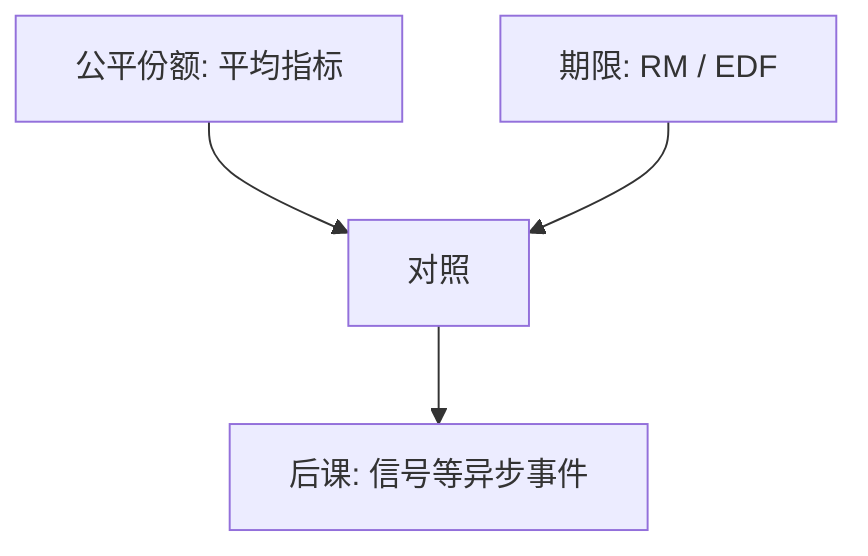

# 实时调度对照

实时系统的正确性依赖于逻辑结果以及结果产生的时间。

<footer>—— 据 Liu and Layland, Scheduling Algorithms for Multiprogramming in a Hard-Real-Time Environment, 1973 整理</footer>

[上一课](/cs/load-balance-migrate)用虚拟时间摊份额，优化的是公平与平均响应。控制回路、多媒体截止时间要的是「在 $T$ 之前跑完」，份额再公平也可能全体逾期。缺口是对照：**周期任务、截止时间、可调度性**，而不是再调 nice。

## 问题

硬实时：错过期限即失败；软实时：错过可贬值但仍希望少错过。任务常写成周期 $P$、最坏执行 $C$、截止 $D$（常取 $D=P$）。缺口不是 PCB 新字段的清单，而是问：给定一组 $(C_i,P_i)$，固定优先级或动态优先级能否让所有截止满足。

本课只引入率单调（RM）与最早截止优先（EDF）的对照，不把全部响应时间分析写完。

Liu 与 Layland：周期任务、抢占、独立、同时在周期起点就绪。RM 按周期长短定优先级；利用率不超过 $n(2^{1/n}-1)$ 则 RM 可调度。EDF 界限是 $1$。

## 方法

RM：周期越短优先级越高，静态。EDF：谁的绝对截止更早谁跑，动态。两者都假定可抢占、忽略切换税（教学）。若还有 CFS 那种公平份额与实时队列并存，实时队列必须先于公平队列，否则期限被后台编译吞掉。

优先级反转（锁被低优先级占着）本课点名存在，展开要等锁课。

## 机制

CFS 最小化的是虚拟时间差；RM/EDF 最小化的是逾期。同一条线程不能同时用两套目标当主策略：实时线程若仍被 vruntime 拉平，期限无意义。通用操作系统因此把策略分类——分时一类，实时一类——而不是「更小的时间片」。

最坏执行 $C$ 必须真是上界；缓存与中断下半部会把 $C$ 拉长，所以实时系统还要限制 ISR。本课不写 WCET 测量。

## 边界

本课不把 POSIX `SCHED_DEADLINE` 的 CBS 服务器写完，不引入弱硬实时的 $m$-in-$k$ 模型。也不声称桌面 Linux 默认就是硬实时：那是配置与补丁的问题，主干只对照目标函数。

弱实时多媒体常用软期限加缓冲；不要把桌面音频 droop 当成 Liu–Layland 硬实时失败。

后课默认：分时看份额，实时看期限。异步事件如何打断用户线程（仍非设备 IRQ），下一课讲信号。

## 小结

- 公平摊时间不保证截止；RM/EDF 才对着 $(C,P)$ 说话。
- 实时队列必须能抢占分时队列。
- 锁引起的优先级反转留到同步课。
- 出处：Liu and Layland, *JACM* 1973；Silberschatz et al., *OSC* 实时调度。
