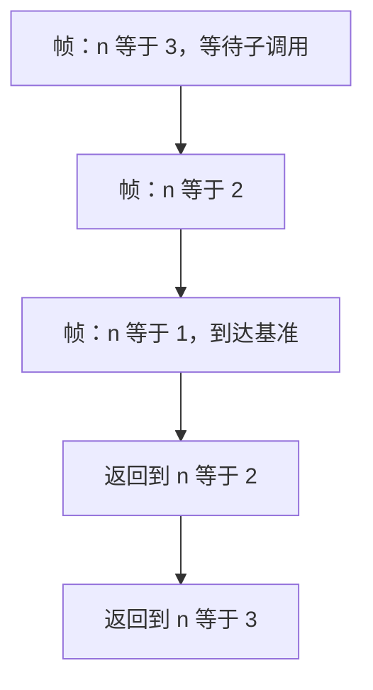

# 递归与栈帧

每一次尚未返回的调用都占一帧；递归把同一函数的许多帧叠在栈上，深度就是还没付清的调用次数。

<footer>—— 据 Bryant and O'Hallaron, Computer Systems: A Programmer's Perspective；Kernighan & Ritchie, The C Programming Language, 2nd ed. 整理</footer>

上一课[调用约定直觉](/cs/calling-convention-preview)钉死了：一次调用靠 ABI 交接参数与返回地址。本课不重讲寄存器表，也不从数学归纳法另起。缺口是：同一函数被再次进入时，**旧的局部变量到哪去了**？为何递归能「同时」拥有许多份 `n`，以及这份能力的上限在哪。

## 问题

调用约定已经保证：进入 callee 时有新的参数槽与返回地址。递归只是 callee 碰巧等于 caller 的函数。每一层仍按同一协议建帧：局部自动变量、保存的寄存器、返回地址。缺口因此不是「递归语法」，而是**帧与调用一一对应**：尚未返回的调用次数等于活着的帧数；返回时只弹出最上面一帧，外层的局部完好。

把递归理解成「函数改自己的全局状态」会立刻写错：那是在静态存储上叠状态，层与层互相踩。栈帧给出的是按深度隔离的自动存储。树遍历、分治、表达式求值都靠这一隔离；它们的共同点是等待子调用返回后再用本层的局部。

### 递归不是「比较慢的循环」

循环在同一帧里改局部；递归每层一帧，额外付出调用与返回。尾递归在某些语言里可以复用帧，C 并不保证这种消除。把递归等价于循环，会看不见栈上限：循环计数器溢出是整数问题，递归过深是栈溢出，两者的失败模式不同，后课未定义行为与信号会分开处理。

CSAPP 用栈帧图解释递归阶乘与深调用。K&R 指出自动变量在每次进入时新生。本课不把 Y 组合子或闭包转换请进来，那是另一套编译课。

## 方法

一帧通常含：返回地址、callee-saved 寄存器、局部与临时、对齐填充、可能的溢出参数区。递归深度 $d$ 则栈上约有 $d$ 帧。帧大小由局部数组与编译器决定，不由「递归」这个词决定：局部若有大数组，几层就会碰上限。

基准情形必须在有限步内到达，否则帧一直增长直到栈耗尽。互相递归只是若干函数交替建帧，机制相同。通过指针把本层局部交给子调用是合法的，只要子调用返回前不用这些指针——寿命规则下一课才总括，本课先看见：子帧活着时，父帧也还活着。

互递归、间接递归（经函数指针）不改变「一调用一帧」。函数指针让 callee 在运行时才确定，帧的大小按真正进入的那个函数来。可变长度局部数组让帧大小成为运行时量，栈预算更难在编译期看见。这些都是深度资源的变体。后课把越出帧寿命、越出对象边界的事收成未定义行为；栈映射本身耗尽则通常先变成操作系统终止，程序员不能把它当成返回码来检查。

## 机制

栈向固定方向增长（常见向低地址）。操作系统给的栈资源有上限，越过则典型地收到信号或直接终止。这与堆的 `malloc` 失败不同：栈扩展往往不可在用户代码里「检查返回值」。因此递归算法必须有深度预算，或改成显式堆上的栈/队列。

同一函数的不同帧可以别名吗？可以，若你把内层指针传到外层并在返回后使用——那时内层已死。活着的嵌套期间，内层指向外层局部是常见模式（输出参数）。帧提供隔离，指针可以主动打破隔离；打破之后寿命由程序员负责。

调试器里看到的回溯，正是这些尚未返回的帧串成的链：每一行对应一个返回地址槽。优化后的尾调用可能复用帧，回溯变短，源码里的「递归」在机器上变成跳转——C 不保证发生。相反，未优化时过大的局部数组会让两三次调用就耗尽映射。本课把深度当资源：算法选递归，等于选了栈预算。后课未定义行为会把「用完已经返回的帧」收成悬挂；溢出栈本身通常先变成操作系统信号，再表现为崩溃，而不是一个有定义的错误码。

## 边界

本课不讲协程如何把帧搬到堆上，不讲内联如何消去调用。下一课[未定义行为](/cs/undefined-behavior)把「越出抽象机器」总括成语言契约。后课默认：每次调用一帧；递归深度受栈限制；返回后该帧上的自动对象结束寿命。

基准情形必须在源码里可见且可达，不能靠「栈总会用完」当终止条件。深度由输入决定时，要在进入递归前检查预算，或改成堆上的显式栈。帧图与调用约定一致：返回只弹出当前层，外层局部仍在。

## 小结

- 尚未返回的调用各占一帧；递归是同一函数的多层帧。
- 层与层的局部互不覆盖，除非用指针主动共享。
- 深度受栈上限约束，失败模式不同于循环。
- 下一课把越界、溢出、非法指针收成未定义行为。
- 出处：CSAPP 栈帧；K&R 自动变量的寿命。
