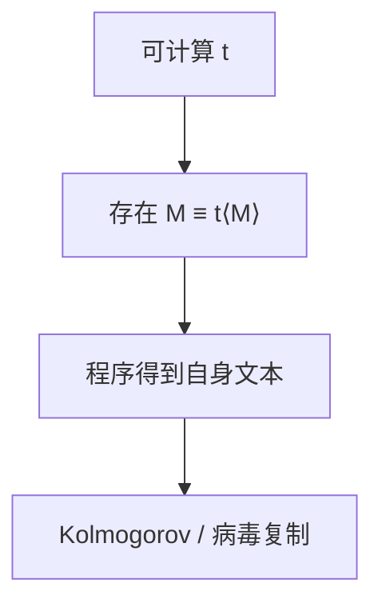

# 递归定理

任何可计算变换 $t$，都有机器 $M$ 使 $M$ 与 $t(\langle M\rangle)$ 计算同一函数；程序可以获得自身的文本。

<footer>—— 据 Kleene；Sipser 整理</footer>

上一课[Rice](/cs/rice-theorem)谈外延性质，机器看不到自己的编码——除非我们另给。缺口是**Kleene 递归定理**（不动点）：存在自指程序。病毒「把自身复制进输出」、构造「打印自己的源」都落在这里；后课 Kolmogorov 也要用最短描述的自指。

## 问题

可计算函数 $t$ 把编码变成编码。递归定理：存在 $e$，$\{e\}=\{t(e)\}$（同一部分函数）。构造：先做「给定 $w$，算出 $\langle P_w\rangle$ 再跑 $t(\langle P_w\rangle)$ 于输入」，其中 $P_w$ 是「先写出 $w$ 再做……」的机器。对角地喂入自身描述。本课要存在性与用法，不把组合子 $Y$ 提前（那是 λ 课）。

没有定理时，TM 的 $\delta$ 表里写不进「本机的 $\langle M\rangle$」——表是有限的，编码依赖于整张表。递归定理说：先允许一个变换假定「编码会填进来」，再保证有填法一致。应用：构造 $M$ 在输入 $w$ 上检查 $w=\langle M\rangle$ 之类的机器，证明仍合法。

### 不是数学归纳法

名字里的 recursion 是自指，不是「对 $n$ 归纳」。程序递归调用自身是其推论：调用时编码已知。

Kleene 第二递归定理。Sipser 用「获得自身描述」的应用版。Quine（打印自身的程序）是同一现象的玩具。固定点在 λ 课用 $Y$，对象换成项。

## 方法

应用：存在 $M$ 输出 $\langle M\rangle$ 然后停（Quine）。不要用定理声称「一切自修改代码都不可分析」——Rice 已经管语义；这里管的是描述的存在。

## 机制

有了自指，才能写「最短程序」时出现的循环论证：描述「比这个还短的程序不存在」会指涉自身长度。下一课 Kolmogorov 复杂度不可计算，递归定理提供合法性。也可用来给 Rice 另一种证明，本课不换证明。

与停机的关系：自指程序仍是普通 TM，停机问题并不因此可解。

构造病毒「把自身写入文件」在模型里合法，不增加计算类。证明停机时不能假设「程序不知道自己的源」——它可以知道。Kolmogorov 课用自指封住「最短不可压缩串」的描述。

## 边界

本课不引入 $s$-$m$-$n$ 定理的全部细节，不写组合逻辑。不讨论生物学或实际恶意软件。后课默认：需要「机器带着自己的源」时，递归定理保证存在。下一课把最短描述当成复杂度。

自指给出的 $M$ 仍是普通图灵机，不扩大 RE。后课最短描述的悖论式构造因此合法：描述可以谈论「本串的 $K$」。λ 侧的对应物是 $Y$，不是本课对象。

上一课留下的缺口在本课收口；「递归定理」进入后课词汇表后只引用。文献用来钉对象与边界，不把本课写成该主题的独立综述。

## 小结

- 任意可计算 $t$ 有不动点机器：$M$ 与 $t(\langle M\rangle)$ 同函数。
- 程序可以合法地引用自身编码。
- 自指不增加可计算类，只增加构造手法。
- 后课 $K(x)$ 的自指描述靠本课才合法。
- 出处：Kleene；Sipser。
