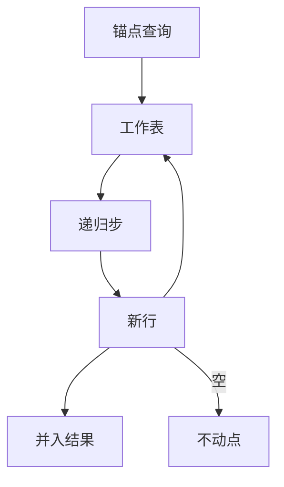

# 递归 CTE

WITH RECURSIVE 把线性递归写成声明：锚点关系并上递归步，迭代到不动点；图上的路径是关系上的传递闭包。

<footer>—— 据 SQL:1999 递归查询；Bancilhon and Ramakrishnan 对演绎数据库；Ramakrishnan and Gehrke 整理</footer>

[上一课](/cs/subquery-decorrelation)把有限嵌套拉平。本课不重做半连接。缺口是**无界深度**：组织树、账单分录、图上可达。固定层数的自连接写不下「任意深度」。递归公共表表达式（CTE）用锚点查询 union 递归查询，语义是最小不动点（在单调、分层的限制下）。

## 问题

关系代数的五种运算没有传递闭包。要「从根走到所有下属」，应用循环会丢掉声明性。演绎数据库用 Datalog 的最小模型；SQL 把其中线性递归收成 `WITH RECURSIVE`。缺口是：迭代如何定义、何时停、环怎么处理，而不是「语法里有个 WITH」。

锚点：不引用 CTE 名的查询，给出第 0 层。递归步：引用 CTE 名，把上一轮结果接到基表上（通常再连接边关系）。重复直到某轮没有新行（集合语义）或包计数稳定。SQL 对递归形状有限制：常见是线性递归（递归名在 FROM 里只出现一次），禁止在递归步里随意聚合或否定，以免失去单调性。

Datalog 的最小不动点要求正例程序。SQL 引擎用迭代加工作表实现，遇到环要用 `UNION`（集合）去重，否则 `UNION ALL` 会沿环无限长。CYCLE 子句是后来标准对环的显式检测。

## 方法

求值：工作表 ← 锚点；结果 ← 锚点；反复：新 ← 递归步(工作表)；把新行并入结果（集合则去重）；工作表 ← 新；直至新空。这是半朴素求值的简化：每轮只用上一轮新行，避免重复派生。

图查询：边表 `E(src,dst)`，锚点选起点，递归步 `工作表 ⋈_{id=src} E` 投影 `dst`。最短路、带权，要用额外列与「只保留更短」的规则，纯递归 CTE 能写但易错；本课不把图专用引擎当 SQL 递归的替代定义。

## 机制

递归 CTE 对优化器是另一个防火墙：不能把外层限行随便推进递归步（`LIMIT` 在外层常切断的是最终结果，不是迭代次数）。有的引擎提供 `SEARCH`/`CYCLE` 控制深度优先与环。计划上递归步每轮都是一次查询，连接算法每轮重选或固定——实现细节，语义仍是迭代并。

与窗口、分组不同：递归的输入规模随轮次变。基数估计对递归几乎没有好统计，计划往往保守。这不影响指称。

## 边界

本课不讲 Datalog 的全体分层否定与魔法集改写。也不把图数据库的遍历代数写成 SQL 的超集——后课图库另开。相互递归、递归中的聚合（如公司树合计）在标准里受限，点名存在，不把每个方言扩展当主干。

后课默认：传递闭包与树展开用递归 CTE 声明；停机靠集合并或显式环检测。下一课把 `EXISTS`、交并差与半连接在用户语言里对齐。

递归是声明的迭代，不是存储过程里的游标循环。不动点一旦到，结果是关系。

## 小结

- 锚点给出第 0 层，递归步迭代到不动点；线性递归是 SQL 的常见子集。
- 环上必须去重或 CYCLE，否则 `UNION ALL` 不终止。
- 集合运算与 EXISTS 下一课，对照存在量化与差。
- 出处：SQL:1999；Bancilhon and Ramakrishnan；Ramakrishnan and Gehrke。
