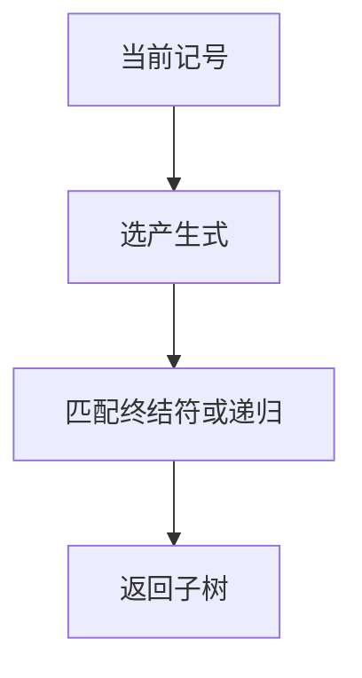

# 递归下降

每个非终结符一个函数；看当前记号决定用哪条产生式，再按右部依次匹配或递归。

<footer>—— 据龙书第 4 章；递归下降作为 LL 的手工实现整理</footer>

上一课[二义与左递归](/cs/ambiguity-leftrec)给了产生式与推导树。本课不重定义 CFG。缺口是：**分析器**——从记号流建树。最直接的做法是最左推导的手工翻译：非终结符变成过程。本课只处理可递归下降的文法：无左递归、每次看一个记号能决定产生式。FIRST/FOLLOW 的系统计算下一课才写。

## 问题

文法在纸上，编译器要消费[词法](/cs/regex-lexer)的流。递归下降：`parseE` 看 lookahead，选 $E\to E+T$ 或 $E\to T$——但左递归会令 `parseE` 尚未读记号就再进 `parseE`，不停机。缺口先是**改写左递归**为右递归或循环，再写函数。预测失败则报语法错误。

这是 LL(1) 的直觉实现。本课用一记号前瞻，不写表驱动。

### 左递归不是「递归」本身有罪

右递归 $T\to F*T$ 对应函数末尾递归，可终止。左递归是「不消耗记号的自调用」。改写会改变结合性，要用循环恢复左结合，那是实现细节，本课点名。

龙书把递归下降当作教学分析器。错误恢复（恐慌模式跳到同步记号）本课只承认需要，不写完整策略。后课 LL 表是同一预测的表格化。

## 方法

对每个 $A$ 写 `parseA`：按 lookahead 选产生式，右部终结符 `match`，非终结符调用。建树：函数返回节点。消除直接左递归：$A\to A\alpha\mid\beta$ 改为 $A\to\beta A'$，$A'\to\alpha A'\mid\varepsilon$。

[栈与调用](/cs/stack-adt)实现递归；深度与语法嵌套成正比，不是图的 DFS 边分类。

## 机制

每个函数的契约：从当前记号起消费 $A$ 的一段，失败则诊断。公共前缀要用提取左因子，否则一个记号看不出选哪条——那已是 LL(1) 冲突，下一课命名。本课若手写时出现「两个分支同一记号」，就该改文法。

回溯（试一条失败再试另一条）可分析更大语言，最坏指数；主干不用。

## 边界

本课不算完整 FIRST/FOLLOW 集合算法。不处理 LR 的移进归约。不把表达式优先级用二十层非终结符写完——可用循环加优先级表，仍属下降族。后课默认：无左递归、可预测的文法有一份递归下降。系统化 FIRST/FOLLOW 与 LL(1) 表是下一课。

## 小结

- 递归下降 = 最左推导的函数实现；一看一记号预测。
- 左递归必须改写；公共前缀要提取。
- 不用指数回溯。
- 出处：Aho et al., 龙书第 4 章。
