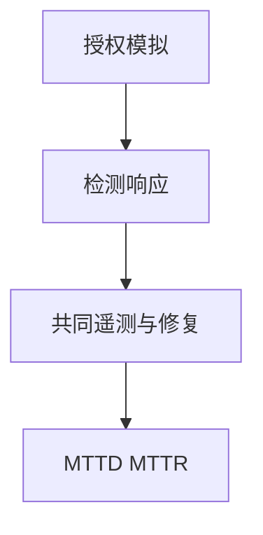

# 红蓝对抗

红队在授权下模拟对手，蓝队检测与响应，紫队让两边共用同一套遥测与教训。对抗的产品是检测覆盖与响应时间，不是一份「打穿了」的战报。

<footer>—— 据 NIST 对红队的讨论；MITRE 对 ATT&CK 评估的实践；对照 Anderson 对激励</footer>

## 定位

上一课[渗透测试](/cs/pentest-methodology)有明确窗口。缺口是**持续对抗与紫队闭环**。本课讲组织角色，不写红队利用配方。

后课默认已经读完本课钉下的合同，只补差，不从该领域第一性原理重开。

## 问题

一次渗透测试后控制回潮。红蓝持续：假设已被突破（assume breach）测检测。缺口是安全的度量：MTTD/MTTR，而不是红队积分。

### 激励

红队若只以打穿为荣，会隐藏可修复的检测改进。紫队改激励。

授权与范围仍然必要。禁止未授权。下一单元系统与硬件从 SELinux 起。

## 方法

assume breach 场景、检测工程、复盘进 ATT&CK 覆盖。网络防御课序封口。

图中节点是本课的机制骨架；课程不把图展开成可运行的攻击步骤。

## 机制

组织学习循环。下一单元从强制访问控制与提权路径谈系统层。

前提写进合同之后，游戏外的误用只当失败模式点名，不在本课写成操作程序。

## 边界

不写利用。下一单元第一课 SELinux 类型强制。

## 小结

- 渗透测试有窗口；红蓝是持续授权对抗。
- 产品是检测与响应，不是战报炫耀。
- 紫队改激励，让洞变成覆盖。
- 下一单元：SELinux。
- 出处：NIST 红队讨论；MITRE ATT&CK；Anderson。
