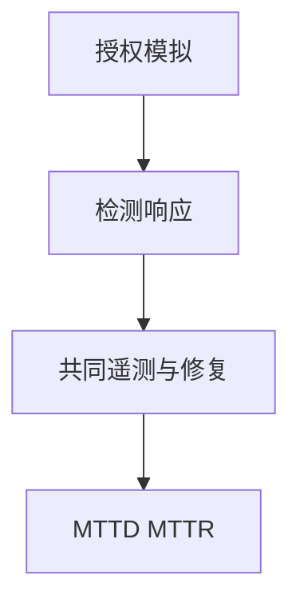
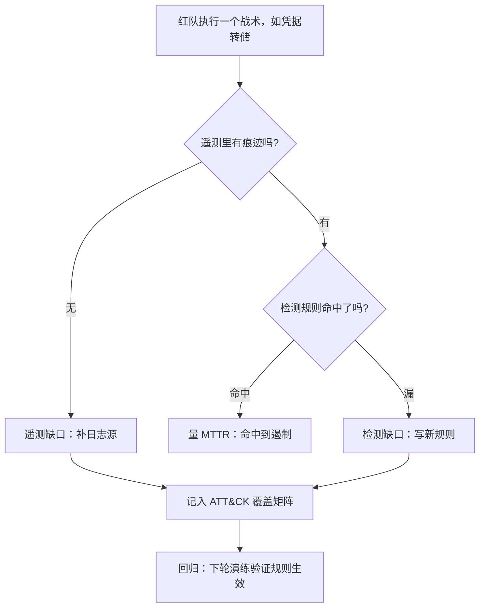

# 红蓝对抗

红队在授权下模拟对手，蓝队检测与响应，紫队让两边共用同一套遥测与教训。对抗的产品是检测覆盖与响应时间，不是一份「打穿了」的战报。

<footer>—— 据 NIST 对红队的讨论；MITRE 对 ATT&CK 评估的实践；对照 Anderson 对激励</footer>

上一课[渗透测试](/cs/pentest-methodology)有明确窗口。缺口是**持续对抗与紫队闭环**。本课讲组织角色，不写红队利用配方。

后课默认已经读完本课钉下的合同，只补差，不从该领域第一性原理重开。

## 问题

一次渗透测试后控制回潮。红蓝持续：假设已被突破（assume breach）测检测。缺口是安全的度量：MTTD/MTTR，而不是红队积分。

### 激励

红队若只以打穿为荣，会隐藏可修复的检测改进。紫队改激励。

授权与范围仍然必要。禁止未授权。下一单元系统与硬件从 SELinux 起。

术语翻译：MTTD 是「从入侵发生到被发现的平均时长」，MTTR 是「从发现到处置完毕的平均时长」。直觉类比：家里进了小偷，MTTD 衡量你多久察觉，MTTR 衡量察觉后多久把他请出去并换锁——红队积分只说明门锁得住不住，不说明你醒着没有。

常见误区：初学者容易以为红蓝对抗的产出是红队「打穿」的战报。打穿只是起点：如果该战术蓝队事后检测不到，同一手法换个入口重来还会得手——战报好看，防线没变。

## 方法

assume breach 场景、检测工程、复盘进 ATT&CK 覆盖。网络防御课序封口。

```mermaid
flowchart TD
  RED["授权模拟"] --> BLUE["检测响应"]
  BLUE --> PURPLE["共同遥测与修复"]
  PURPLE --> MET["MTTD MTTR"]
```

## 机制

组织学习循环。下一单元从强制访问控制与提权路径谈系统层。

直觉类比：紫队不是第三支队伍，而是红蓝两边坐进同一间复盘室——红队逐步交代「我从哪进来、踩过哪些脚印」，蓝队对着遥测逐条核对「这些脚印我当时看得见吗」，差异就是待补的缺口。

```mermaid
flowchart TD
  ACT["红队执行一个战术，如凭据转储"] --> Q1{"遥测里有痕迹吗?"}
  Q1 -->|"无"| GAP1["遥测缺口：补日志源"]
  Q1 -->|"有"| DET{"检测规则命中了吗?"}
  DET -->|"命中"| TTR["量 MTTR：命中到遏制"]
  DET -->|"漏"| GAP2["检测缺口：写新规则"]
  GAP1 --> REG["记入 ATT&CK 覆盖矩阵"]
  GAP2 --> REG
  REG --> NEXT["回归：下轮演练验证规则生效"]
```

## 边界

不写利用。下一单元第一课 SELinux 类型强制。

## 小结

- 渗透测试有窗口；红蓝是持续授权对抗。
- 产品是检测与响应，不是战报炫耀。
- 紫队改激励，让洞变成覆盖。
- 下一单元：SELinux。
- 出处：NIST 红队讨论；MITRE ATT&CK；Anderson。
