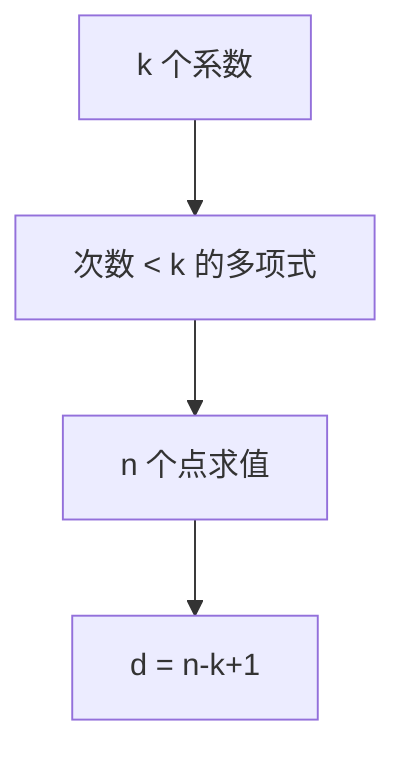

# Reed–Solomon

把信息当成多项式系数，在有限域的 $n$ 个点上求值；任意 $k$ 个点都能重建，于是可纠 $n-k$ 个符号级擦除，或约一半替换错误。

<footer>—— 据 Reed and Solomon, 1960；MacWilliams and Sloane 整理</footer>

上一课[汉明码](/cs/hamming-code) 是二元、纠 1 比特。缺口是**符号级**：磁盘扇区、QR、光盘上的突发错误。Reed–Solomon（RS）在 $\mathbb{F}_q$ 上，$q>n$，码字是次数 $<k$ 的多项式的求值向量。$d_{\min}=n-k+1$（Singleton 达到，MDS）。本课要求值图像；有限域构造在数论单元。

## 问题

信息 $m(x)=m_0+\cdots+m_{k-1}x^{k-1}$。码字 $(m(\alpha_1),\ldots,m(\alpha_n))$。擦除 $e$ 个位置：剩 $n-e\ge k$ 个点，插值唯一。替换错误 $t$：Berlekamp–Welch / 关键方程，可纠 $t\le\lfloor(n-k)/2\rfloor$。突发：二元突发变成少数符号错，RS 比 Hamming 合适。

不要在本课展开 $\mathrm{GF}(2^8)$ 的不可约多项式——只假设能算加减乘除。

### 距离是符号汉明距离

[汉明距离](/cs/hamming-distance) 课已声明 RS 换字母表。一个符号错可以是 8 比特全翻，仍只计距离 1。

Reed–Solomon 1960。Peterson、Berlekamp 译码。Justesen、Guruswami–Sudan 列表译码点名。存储阵列、QR 是应用，不是定义。

## 方法

用小域手写 $k=2,n=4$ 求值。对照重复码、Hamming：MDS 在给定 $n,k$ 下 $d$ 最大。指出：编码是线性的（Vandermonde）。译码比伴随式定位重，本课只给「插值 / 关键方程」名字。

## 机制

容量：RS 不随 $n\to\infty$ 在 BSC 上自动达容量（字母表也在涨）。它是代数码的代表，后课 LDPC 才是近容量的稀疏随机码。RS 常作外码，与内码级联。

多项式观点与主干 CRC 同族：CRC 检错，RS 纠错并给距离公式。

BCH 码把 RS 看成设计距离的子域子码；二进制 BCH 纠少量比特时比 Hamming 更灵活。Guruswami–Sudan 列表译码可超过半距离，代价是列表。级联：外 RS 去突发，内卷积或 LDPC 去随机，是深空通信的经典分层，后课内码。

## 边界

本课不写 Berlekamp–Massey 全文，不引入 BCH 的设计距离。有限域下一单元才系统讲。后课默认：符号 MDS 码即 RS 直觉。下一课卷积与 Viterbi。

MDS 在给定 $n,k$ 下距离最大，字母表必须够大。插值重建擦除；替换错误要关键方程。有限域算术本单元只假设能做，构造在数论课。

上一课留下的缺口在本课收口；「Reed–Solomon」进入后课词汇表后只引用。文献用来钉对象与边界，不把本课写成该主题的独立综述。

## 小结

- RS = 多项式求值；MDS，$d=n-k+1$。
- 纠擦除到 $n-k$，纠替换到 $\lfloor(n-k)/2\rfloor$。
- 字母表是有限域符号，不是比特汉明。
- 出处：Reed and Solomon, 1960；MacWilliams and Sloane。
