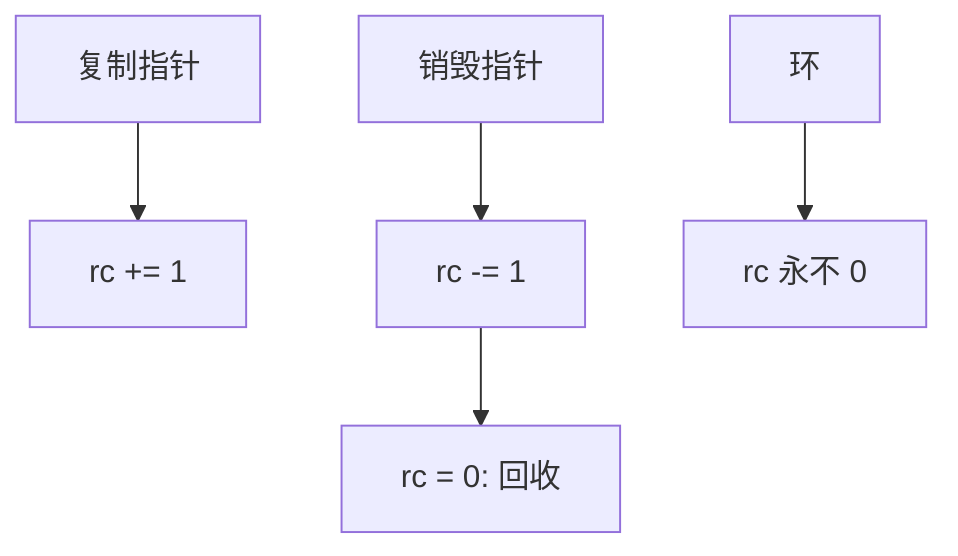

# 引用计数与环

计数到零立即回收，局部性好；对象图一旦成环，计数永远到不了零。环要弱引用、分代或备份跟踪。

<footer>—— 据 Collins, A Method for Overlapping and Erasure of Lists, CACM 1960；Bacon et al., Concurrent Cycle Collection；[运行时 GC](/cs/runtime-gc) 整理</footer>

[上一课](/cs/allocator-structures) 假定 `free` 被正确叫到。[运行时 GC](/cs/runtime-gc) 已从标记谈论自动回收。[路径复制](/cs/persistent-path-copy) 的共享靠计数或 GC。[RCU](/cs/rcu-data-structures) 不用对象图计数。本课是数据结构进阶最后一课：引用计数作为结构不变量，以及环。

## 问题

每个对象 `rc`：指针复制 `+1`，销毁 `-1`，零则把内嵌指针再减并归还分配器。优点：即时、可预测、易与[hazard](/cs/hazard-pointer) 外的单线程所有权混用。环：双向图、父带子、子指父，`rc\ge 1` 永真。缺口不是再讲 buddy，而是**计数不变量推不出可达性**；环是图结构问题。

Collins 1960 早期引用计数。Bacon 等并发环收集把试验删除与备份跟踪结合起来。弱引用不增加 `rc`，打破所有者环。

## 方法

对策：(1) 所有者边强、回边弱；(2) 周期检测（试验性减、对候选环 DFS）；(3) 混合：分代复制/标记扫环，计数管无环。原子 `rc` 的递增开销与伪共享是并发税。溢出与饱和计数是实现细节。

与持久结构：共享子树正是 `rc>1`；无环 DAG 计数正确。与 LSM/无锁：那些结构的节点寿命用 HP/RCU，不靠对象 `rc` 图。

## 机制

数据进阶课序在此封口：序列区间、对数堆与空间树、字符串、草图、持久与无锁，最后把「对象何时死」接回分配器。后课算法进阶从[强连通](/cs/scc-tarjan) 另开，不在这里把 Tarjan SCC 当环收集实现抄完——图算法课再收。

不要把引用计数写成 Transformer 注意力；就是堆对象图。

## 边界

本课不写完整并发环收集证明。不进入限价簿对象。标记-清除/复制 GC 细节见运行时课，本课只对照：跟踪能收环，计数默认不能。

后课默认：无环 DAG 可用引用计数；有环要弱边或跟踪 GC。数据结构进阶主干到此结束；下一课从[强连通分量](/cs/scc-tarjan)起算法进阶。

## 小结

- 引用计数：零即收，即时；环会泄漏。
- 弱引用或跟踪收集破环。
- 本课序结束；图算法课序另起。
- 出处：Collins, *CACM*, 1960；Bacon 等环收集；Wilson/GC 文献与 runtime-gc 课。
