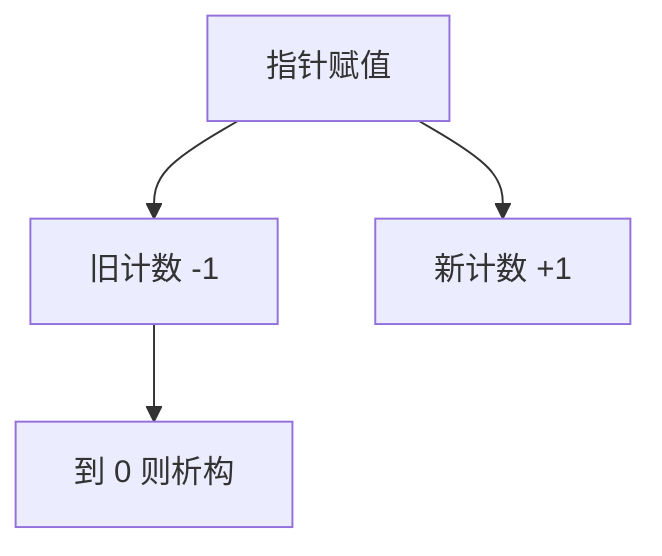

# 引用计数 GC

每个对象记有多少指针指向它，到零则释放。及时，但循环会泄漏，除非配合循环检测或弱引用；更新计数的原子开销在多核上显著。

<footer>—— 据 Collins, A Method for Overlapping and Erasure of Lists, 1960；Jones 手册；对照[线性类型](/cs/linear-ownership) 整理</footer>

上一课[复制式](/cs/copying-gc) 靠追踪。缺口是 **RC**：赋值时减旧加新。Python、Swift（ARC）、部分 Rust `Rc`。本课钉循环与原子，写屏障下一课是追踪式的。不把 RC 当线性类型——线性是静态零计数。

## 问题

追踪有暂停；RC 希望即时回收。循环：`a.p=b; b.p=a` 计数永不为零。解决：周期检测、或禁止循环（所有权树）、或弱引用打破。缺口是**计数协议**，不是 Cheney 扫描。

多线程：计数更新要原子或缓冲（如 Cobsen 的缓冲 RC）。

### RC 不是 malloc/free 手工配对

程序员不写 free；赋值重载负责。但循环与性能仍是实现问题。C++ `shared_ptr` 循环同样漏。

Collins 1960。Bacon、Rajan 等循环回收。Swift ARC。Jones 手册 RC 章。

## 方法

写指针槽：`decref(old); incref(new)`。零则跑析构再释放。优化：局部变量可省略（编译器 RC 消除，类似线性）。

与复制：有的系统幼代追踪、老年代 RC，点名。

## 机制

原子：`increment` 争用热对象。缓冲：把 RC 操作记入线程本地，批量。不要在析构里再形成复杂图而不重入。

与[Option](/cs/null-option)：空指针不 incref。

## 边界

本课不写写屏障卡表。后课默认：RC 及时但不收循环。下一课写屏障与卡表——追踪分代用。

也不把 RC 当文件系统链接计数课（思想类似，对象不同）。

## 小结

- RC：赋值维护计数，零则释放。
- 循环需额外机制；多核要原子或缓冲。
- 与静态线性类型不同层。
- 出处：Collins, 1960；Jones 手册；对照 Bacon 等。
