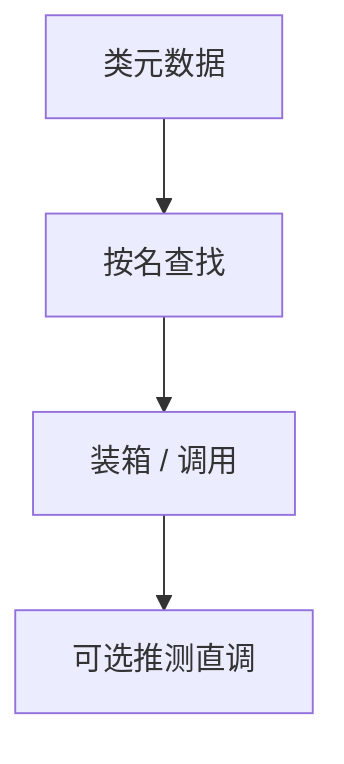

# 反射与元数据

运行时描述类型、方法与字段：名字、签名、注解。反射按名调用，牺牲静态检查与内联，换工具与框架的灵活性。

<footer>—— 据 Java 虚拟机规范属性与反射 API；CLI 元数据；对照[DWARF](/cs/dwarf-debug-info) 整理</footer>

上一课[虚表](/cs/vtable-dispatch) 按槽调用，槽在编译期已知。缺口是**按字符串**：`getMethod("foo")`。元数据表（JVM、.NET）或 RTTI（C++）。本课钉代价，内存模型下一课。不把 Java 注解处理器当全部。

## 问题

调试 DWARF 给工具看；反射给程序看。实现：类文件里的常量池与属性。调用：查找、权限、装箱参数、不能内联。缺口是**这条慢路径与安全**（可访问性），不是 vptr 布局。

擦除泛型：反射看见的是 raw，接[泛型](/cs/generics-monomorphization)。

### 反射不是宏

宏在编译期改树；反射在运行期查表。卫生无关。不要混。

JVM 规范。CLI。C++ RTTI/`typeid`。本课不写 JNI 全部。

## 方法

加载类时解析元数据。API：列举方法、读注解、`invoke`。JIT：对稳定反射调用可降成直调（推测+去优化）。关闭：strip 元数据则反射失败，体积减。

与[符号插入](/cs/symbol-interposition)：`dlsym` 是 C 的反射亲戚。

## 机制

安全：模块系统限制深反射。性能：第一次查找贵，缓存 Method 对象。不要在热循环 `getMethod`。GC：元数据是根（类对象长命）。

## 边界

本课不写内存模型。后课默认：按名调用走元数据。下一课语言内存模型与 data race。

也不把反射当光学。

## 小结

- 反射：运行时元数据 + 按名调用。
- 与 vtable 槽调用、与宏阶段都不同。
- 可被 JIT 推测；可被 strip。
- 出处：JVM 规范；CLI；对照 DWARF、Itanium RTTI。
