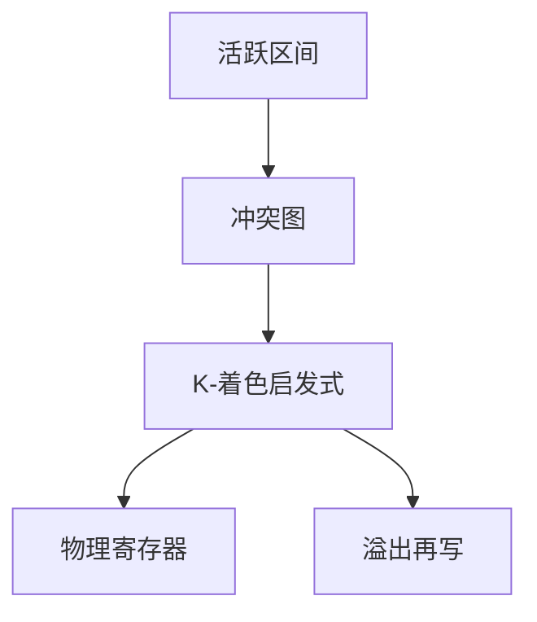

# 寄存器分配着色

同时活跃的虚拟寄存器连边；物理寄存器是颜色。颜色不够就溢出到栈槽。

<footer>—— 据 Chaitin et al., Register Allocation via Coloring, 1981；Chaitin, Register Allocation and Spilling, 1982 整理</footer>

上一课[指令调度](/cs/instruction-sched)留下带虚拟寄存器的机器指令。[活跃变量](/cs/dataflow-liveness)给出同时存活。本课不重选 opcode。缺口是：把无限虚拟名映到有限物理寄存器，或插入 spill。图着色是经典方法；一般图着色 [NPC](/cs/npc-canonical)，编译器用启发式。

## 问题

冲突图：节点为虚拟寄存器（或 SSA 名），边表示不能同寄存器。$K$ 个物理寄存器则求 $K$-着色。 Briggs 等：简化低度数节点、压栈、再着色，失败则选溢出候选、重写再来。缺口是这张图与溢出循环，不是再跑一遍活跃分析的方程。

[调用约定与栈](/cs/calling-convention-stack)已说明调用者/被调用者保存；本课着色必须尊重：跨调用活跃的名字不能占用 caller-save 而不保存。具体哪几个号留给 ABI 课钉死，本课只承认类别（整数/浮点分图）。

### 启发式不是多项式最优

Chaitin 把分配写成着色。NPC 课已警告：不要声称最优多项式。启发式在实际 CFG 上够用。线性扫描是另一派，本课点名对照，不写完。

Chaitin 1981/82（PLDI）。Briggs 的乐观着色减少不必要溢出。SSA 上着色有和弦图特例可多项式，离开 SSA 后一般仍难。本课启发式为主。

## 方法

建冲突图。合并拷贝（不增加冲突时收缩边）以消 `move`。简化：$deg\lt K$ 的点压栈；否则挑溢出代价低的。弹出着色；失败插入 `store/load` 到栈槽，更新 IR，可能再选指令。

栈槽寻址用帧指针，组成课的栈已有；偏移在 ABI 帧布局里统一。

## 机制

溢出增加访存，改变活跃，故可能迭代。φ 在着色前应已拆或与并行拷贝一起处理。不要在本课生成完整 System V 序言。

与 Cache 课：溢出落入栈，局部性变差，不在分配器里模拟 Cache。

## 边界

本课不写窥孔、不输出目标文件格式。不把图着色当通用 NPC 求解作业。后课默认：函数体已是物理寄存器指令加 spill。窥孔在短窗口上再改写。

## 小结

- 冲突图 + $K$-着色；不够则溢出。
- 一般着色 NPC，编译器用简化启发式。
- 调用保存类别约束调色板。
- 出处：Chaitin et al., 1981, 1982；龙书第 8 章。
