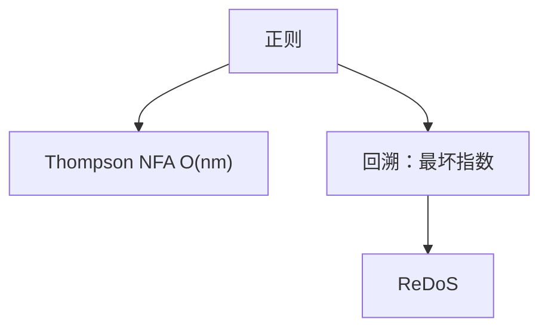

# 正则匹配与回溯爆炸

正则对应 NFA，可线性于文本；回溯实现在嵌套 `*` 上可指数，ReDoS 是算法选择不是语言必然。

<footer>—— 据 Thompson, Regular Expression Search Algorithm, 1968；Aho, Sethi, Ullman 龙书；[Chomsky](/cs/chomsky-hierarchy) 对照整理</footer>

上一课[Lyndon 分解](/cs/lyndon-duval)收束线性串技法。正则匹配在主干词法会再遇。本课缺口是**复杂度**：Thompson NFA 模拟 $O(nm)$，回溯引擎最坏指数。不重写正则→NFA 全构造。后课平面几何。线性串课序在此结束。

## 问题

正则语言可用 NFA，文本长 $n$、表达式长 $m$，Thompson 模拟 $O(nm)$。POSIX/Perl 回溯：每个 `*` 分叉，`a?^n a^n` 一类使路径指数。恶意正则 + 文本 = ReDoS。捕获组、回溯引用超出正则，更难。

缺口是实现模型，不是泵引理。

### 不是「正则很慢」

语言类是正则，算法可以是 NFA。慢来自回溯实现。不要把正则语言判成 NPC。

Thompson 1968。Russ Cox 对回溯 vs NFA 的工程论述广泛引用。龙书词法扫描。后课凸包换几何。

## 方法

要最坏线性：Thompson NFA 或 DFA（DFA 可能 $2^m$ 状态）。需要回溯特性才用回溯，并限制或超时。诊断：嵌套量词 + 长失败文本。

DFA 最小化接[DFA 最小化](/cs/dfa-minimization)。

## 机制

NFA 位集或列表模拟：当前位置集合，每字符扫边。回溯是 DFS 这条 NFA，最坏走遍路径。与 CYK：上下文无关才 $O(n^3)$。与 KMP：单模式无 `*`。

## 边界

本课不写 PCRE 全语义。不写递归正则。后课默认：最坏要线性用 NFA；回溯当工程风险。下一课凸包 Graham / Andrew。

## 小结

- 正则语言可 $O(nm)$ NFA。
- 回溯实现可指数，ReDoS。
- 超正则特征另计代价。
- 出处：Thompson, 1968；龙书。
