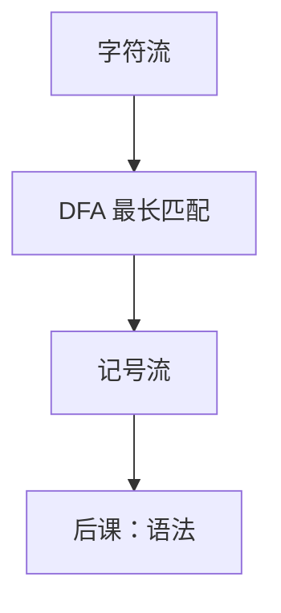

# 正则与词法

词法把字符流切成记号；每一类记号是正则语言，用 DFA 一次扫描识别。

<footer>—— 据 Thompson, Regular Expression Search Algorithm, 1968；龙书第 3 章整理</footer>

上一课[编译器通行证](/cs/compiler-passes)划了管道，第一段是字符到记号。本课不重讲遍的清单。缺口是：标识符、关键字、数字、空白如何**无回溯地**切出来。正则表达式描述记号，NFA/DFA 执行。语法的嵌套括号不是正则，留给 CFG。

## 问题

源文件是[字符](/cs/char-unicode)序列。若用递归下降直接吃字符，关键字与标识符的边界、最长匹配、空白与注释会搅进语法。缺口是单独的词法器：输出 `(种别, lexeme)` 流，丢掉空白与注释。每种别对应正则：$[a-zA-Z][a-zA-Z0-9]^*$ 等。

[KMP](/cs/kmp) 是单模式精确匹配；词法是**多种记号轮流、取最长**。工具链：正则 $\to$ NFA（Thompson）$\to$ DFA $\to$ 最小化。本课要的是这层分工，不手写最小化证明。

### 最长匹配不是「正则的定理」

词法规则：优先最长 lexeme；同长时按规则表次序（关键字压过标识符）。这是工程约定，写进词法器，不是 Kleene 代数的推论。

Thompson 1968 构造 NFA。龙书第 3 章：词法 = 正则，语法 = 上下文无关。本课遵守这条边界，不把算术表达式放进正则。

## 方法

为每个种别写正则，并成一个 NFA，转 DFA。扫描：从当前字符跑到死，回退到最后接受态，吐出记号。错误：无接受则报告非法字符。关键字表可在标识符之后查表改种别。

[有限状态机](/cs/fsm-control)组成课已有；这里的 DFA 是同一对象，输入是源字符。

## 机制

词法阶段复杂度对源长线性（DFA）。Unicode 与转义使正则更脏，不改变「记号是正则」的分工。预处理器（宏）在 C 里插在词法前后，本课不把 cpp 写成通行证的必选段。

记号带行号，为后课报错。词法不计算 `1+2` 的值。

## 边界

本课不写 CFG、不匹配括号。正则不能数任意层嵌套。也不把词法器生成器的全部冲突消解写完。后课默认：语法的输入是记号流，不再看见空白。上下文无关文法是下一缺口。

## 小结

- 词法 = 正则语言 + DFA 最长匹配，输出记号。
- 嵌套结构不是正则，不在本课。
- 关键字用表在标识符上覆写。
- 出处：Thompson, 1968；Aho et al., 龙书第 3 章。
